# 目錄

- [Note](#0)
- [初識STM32](#1)
  - [STM32與Arduino的差異](#1.1)
    - [單晶片](#1.1.1)
  - [STM32 命名方法](#1.2)
- [STM32CubeIDE安裝以及環境設定](#2)
  - [CubeIDE簡介](#2.1)
  - [下載+安裝流程](#2.2)
  - [IDE閱覽](#2.3)
- [使用STM32CubeIDE](#3)
  - [程式碼導讀](#3.1)
  - [好用小工具 - 現場表達式 (live expression)](#3.2)
  - [好用小工具 - Memory](#3.3)
- [GPIO輸入輸出(上)](#4)
  - [腳位](#4.1)
  - [ioc檔](#4.2)
- [GPIO輸入輸出(中)](#5)
  - [GPIO 輸出-LED閃爍](#5.1)
  - [GPIO - 輸入](#5.2)
- [GPIO輸入輸出(下)](#6)
  - [認識電晶體](#6.1)
  - [推挽輸出&開漏輸出](#6.2)
  - [輸出設定](#6.3)
- [ADC電壓採集](#7)
  - [類比輸入](#7.1)
  - [ADC使用](#7.2)
  - [單通道轉換](#7.3)
- [STM32記憶體架構](#8)
  - [為什麼不取 STM31 STM33](#8.1)
  - [記憶體映射](#8.2)
  - [STM32記憶體區域功能劃分](#8.3)
- [庫函數包裝—對於底層暫存器的操縱(上)](#9)
  - [什麼是暫存器 register?](#9.1)
  - [外設地址映射](#9.2)
- [庫函數包裝—對於底層暫存器的操縱(下)](#10)
  - [C語言對暫存器的封裝](#10.1)
  - [HAL_GPIO_WritePin()做了哪些事?](#10.2)
- [NVIC中斷概要](#11)
  - [中斷是什麼?](#11.1)
  - [優先級定義](#11.2)
  - [優先級分組](#11.3)
- [EXTI外部中斷&事件控制器](#12)
  - [外部中斷](#12.1)
  - [實作-利用開發版上的按鈕執行外部中斷](#12.2)
- [STM32輾壓Arduino的功能—TIM(上)](#13)
  - [計時器 TIMER](#13.1)
  - [計數器 counter](#13.2)
  - [PSC & ARR讓你的時鐘可快可慢](#13.3)


<h1 id="0">Note</h1>

- https://ithelp.ithome.com.tw/users/20141525/ironman/4839

<h1 id="1">初識STM32</h1>

- STM32系列是專為需要高效能、低功耗的嵌入式系統所專門設計的**ARM Cortex核心**

<h2 id="1.1">STM32與Arduino的差異</h2>

- STM32與Arduino都是屬於**單晶片**

- STM32擁有更多的功能：
  - STM32的TIMER有encoder mode，可以將方波直接做處理，對於馬達控制非常方便
  - Arduino是一個開源的電子開發原型平台。其包含硬體開發版和軟體IDE和各種開發生態。所以Arduino是一個集合了硬件和軟件的綜合體。而它上面的微控器是ATmega328p

- 兩者的定位不同：
  - Arduino對**硬體底層做了大量的封裝**，適合給初學者使用：
    - 例如機器人的開發測試：你要測試氣壓感測器的輸出值時，使用Arduino 的analogRead()，會比你用STM32的ADC功能來的快多了
  - 當需求更大時，包括對計算速度以及硬體操縱的要求更嚴苛的時候，STM32就會比Arduino更適合你。

<h3 id="1.1.1">單晶片</h3>

- 單晶片，全稱**單晶片微電腦**，又稱**微控制器單元（microcontroller unit）**，是把中央處理器、儲存器、定時/計數器（timer/counter）、各種輸入輸出介面等都整合在一塊積體電路晶片上的微型計算機。

- 與應用在個人電腦中的通用型微處理器相比，它更強調自供應（不用外接硬體）和節約成本。

- 它的最大優點是體積小，可放在儀表內部，但儲存量小，輸入輸出介面簡單，功能較低。

- 由於單晶片微電腦常用於當控制器故又名single chip microcontroller。台灣稱為「單晶片」；中國則主要採用「單片機」，英文縮寫為**MCU (Microcontroller Unit)**。

<h2 id="1.2">STM32 命名方法</h2>

- STM32F429ZI 開發版

    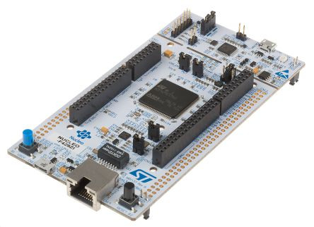

- 命名表

    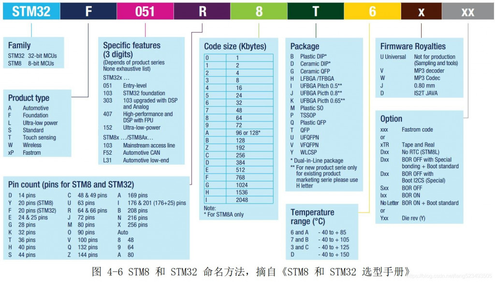

  - Code size - 快閃記憶體(Flash memory)大小

<h1 id="2">STM32CubeIDE安裝以及環境設定</h1>

<h2 id="2.1">CubeIDE簡介</h2>

- STM32CubeIDE可以自動的幫你把腳位的配置生成程式碼，只要用圖形化的介面點一點，就不用自己打一堆，而且他還有很棒的變數監看的功能以及直接更改記憶體值的方式，總之對於新手來說是很方便的。

<h2 id="2.2">下載+安裝流程</h2>

[下載與安裝流程](https://ithelp.ithome.com.tw/articles/10265758#:~:text=%E9%81%8E%E5%85%B6%E4%BB%96%E7%9A%84...-,%E4%B8%8B%E8%BC%89%2B%E5%AE%89%E8%A3%9D%E6%B5%81%E7%A8%8B,-%E8%BB%9F%E9%AB%94%E7%9A%84%E5%AE%89%E8%A3%9D)

[Integrated Development Environment for STM32](https://www.st.com/en/development-tools/stm32cubeide.html)

- 必須在英文路徑下才能執行安裝檔(.exe)

<h2 id="2.3">IDE閱覽</h2>

- 開啟STM32CubeIDE，點擊左上角開啟新的STM32專案

    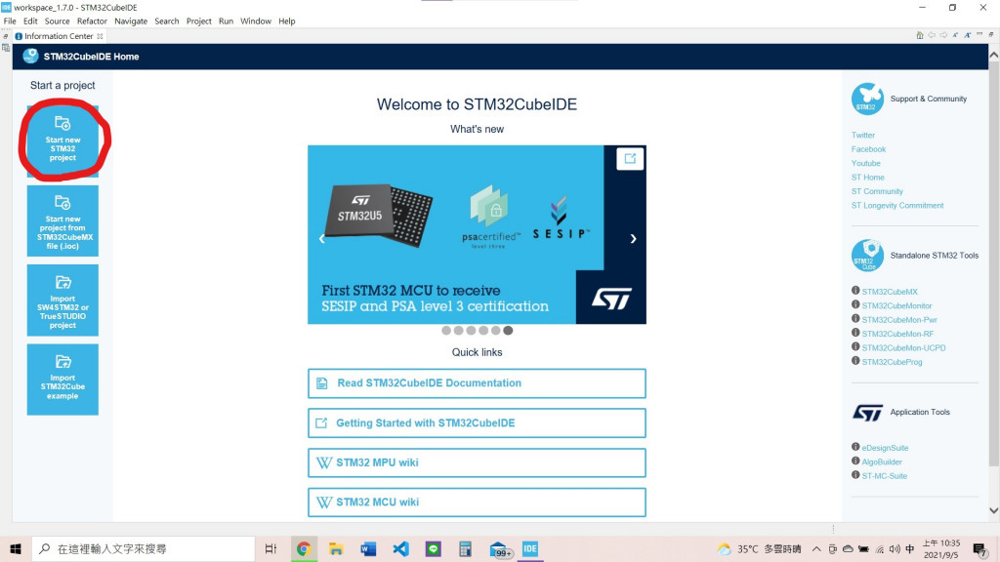

- 搜尋使用的開發版

    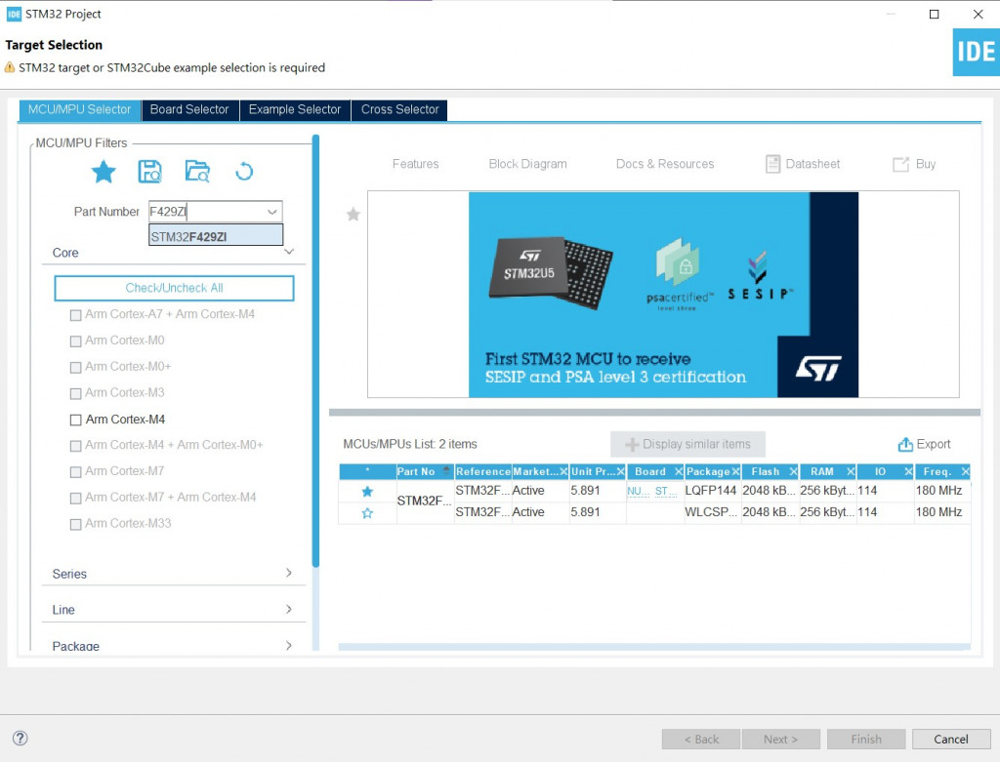

- 設定你的專案名稱

    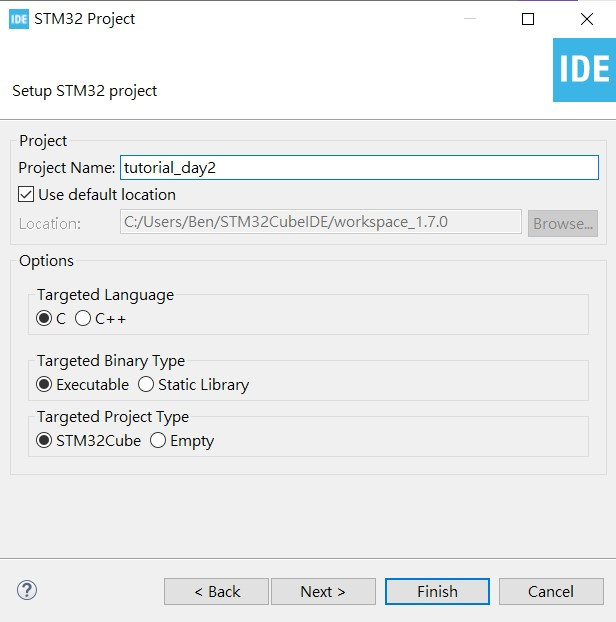

- 如果有跳出這個畫面，就放心的按Yes，然後就會開始初始化，準備開啟檔案了，可能需要一下子

    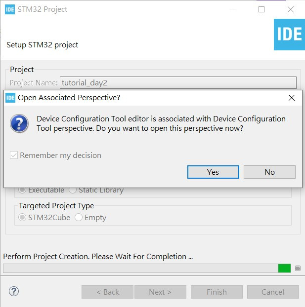

- 左邊的Project Elplorer就是我們進行專案管理的地方，點擊 Core -> Src -> main.c 打開這個.c檔，以後我們就要在這裡寫程式

- 如果開啟後沒有出現可以從上面Window -> Short View -> Project Elplorer打開這個小視窗，其他有些視窗如果不小心手殘被關掉，也可以在這裡打開畫面右邊和底下是程式碼大綱以及一些監控視窗

    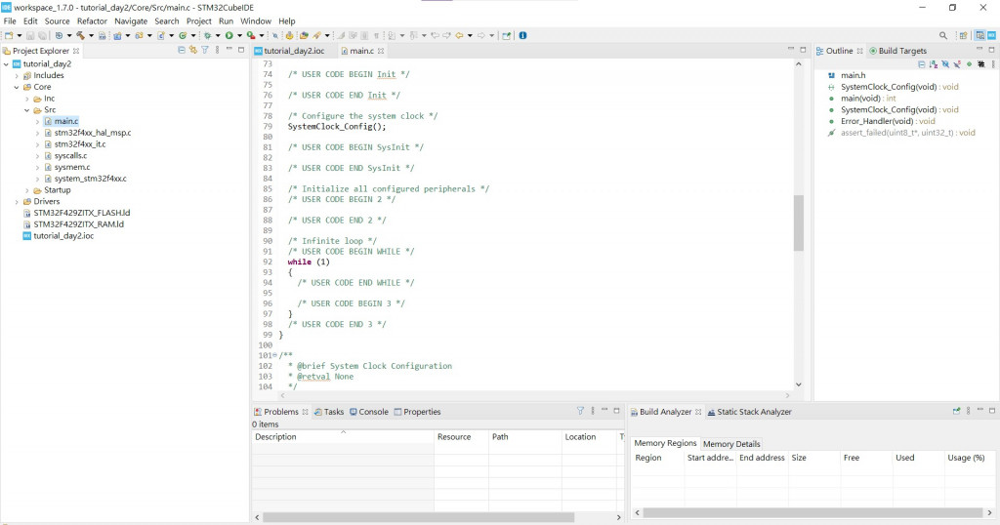

<h1 id="3">使用STM32CubeIDE</h1>

<h2 id="3.1">程式碼導讀</h2>

- CubeIDE可以把我們對於腳位的配置自動生成程式碼，我們只需要在filename.ioc(filename為專案名稱)點一點，儲存後他就會自動生成程式碼了。

- IDE怎麼知道要將自動生成的程式碼放在哪呢?實際上程式已經將程式碼做初步的分類，以下是程式碼最上面的幾行：

    ```C
    /* Includes ------------------------------------------------------------------*/
    #include "main.h"

    /* Private includes ----------------------------------------------------------*/
    /* USER CODE BEGIN Includes */

    /* USER CODE END Includes */

    /* Private typedef -----------------------------------------------------------*/
    /* USER CODE BEGIN PTD */

    /* USER CODE END PTD */

    /* Private define ------------------------------------------------------------*/
    /* USER CODE BEGIN PD */
    /* USER CODE END PD */
    ```

  - 每個類別的開頭都會有長長的虛線，由上到下依序是**Includes**、**Private Includes**、**Private typedef**、**Private define**。
  - 只要該類別是Private開頭的話，後面一定會有**USER CODE BEGIN**與**USER CODE END**這兩個註解，我們的程式碼就需要寫在這裡，而生成程式碼時就會安插在這個區間以外的地方。
  - 很重要的就是你的程式碼一定要放在BEGIN和END之間，否則只要你一生成程式碼，那你的程式碼就會不見了。

    ```C
    /* Private define ------------------------------------------------------------*/
    /* USER CODE BEGIN PD */
    #define PI 3.14159265358
    /* USER CODE END PD */
    ```

<h2 id="3.2">好用小工具 - 現場表達式 (live expression)</h2>

- 變數監測的小視窗，但他只能對**全域變數**(沒有被任何大括號框住的變數)進行監測

- 是一個debug的工具，因此正常執行的情況下式是不能使用的，需要點選工具列那排小蟲蟲的圖示以debug的方式執行(快捷鍵為F11)，執行的時候可能會產生一些視窗提醒，都按Yes即可。

- 在上面工具列那排的Window->Short View->現場表達式，就會出現在右邊的小視窗

    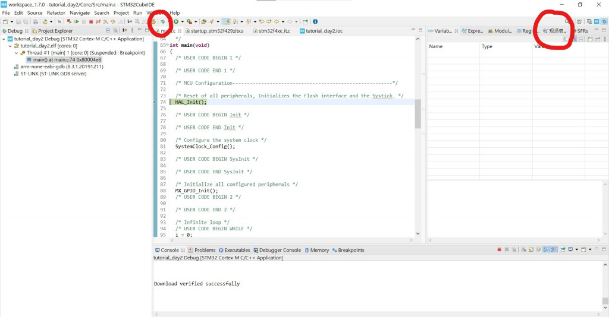

- 接下來你會看到你的程式碼停在main函式裡面的第一行，在我這裡的情況下是`HAL_Init()`這一行

    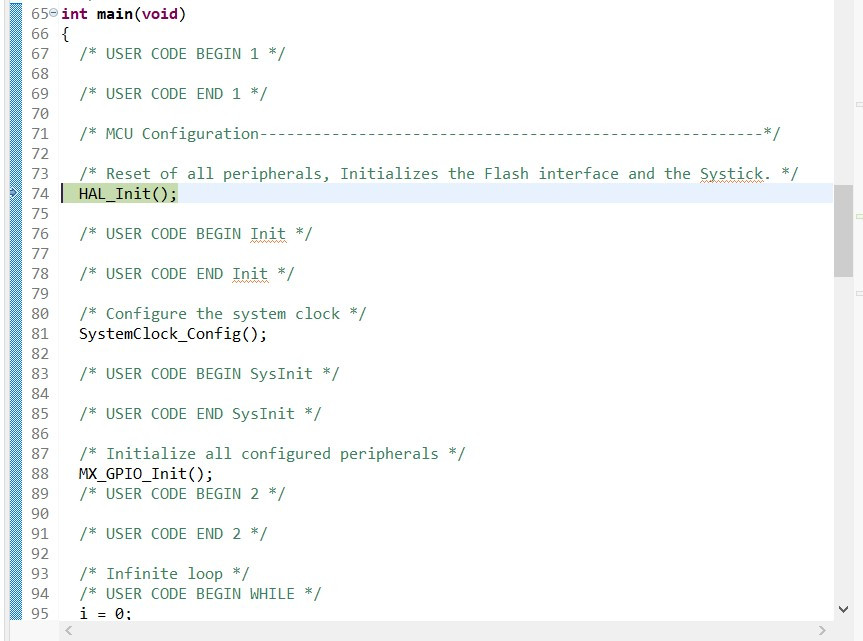

- 非常重要!!!這個時候你的程式碼還沒有開始執行，需要**按F8才會開始執行**

**實際使用看看這個功能：**

- 要記得在全域的地方新增變數 i, HAL_Delay()，單位為ms

- 用debug的方式執行，並在現場表達式的視窗內增加新表達式，就可以看到 i 每隔一秒增加1了

- 可以直接打上&var(var為你要監測的變數)，這樣可以直接獲取這個變數的記憶體位置

    ```C
    /* Infinite loop */
    /* USER CODE BEGIN WHILE */
    while (1)
    {
    /* USER CODE END WHILE */

    /* USER CODE BEGIN 3 */
        i++;
        HAL_Delay(1000);

    }
    /* USER CODE END 3 */
    ```

<h2 id="3.3">好用小工具 - Memory</h2>

- 這個工具的目的是取代Arduino的序列阜的功能，由於STM32並沒有提供人和單晶片溝通的介面，我們在測試的過程中經常會需要調整參數，因此就需要頻繁的上傳程式，而用這個功能就可以直接更改變數的值。

- **變數是存放在RAM當中，因此我們這個動作就是直接更改RAM的數值**

- 一樣是在debug的模式下才可以使用，預設會在底下的視窗，若沒有出現一樣可以從 `Window->Short View->Memory` 裡面找到。

- 首先點綠色的+新增一個你要監測的記憶體位置

    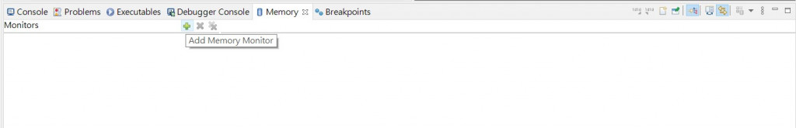

    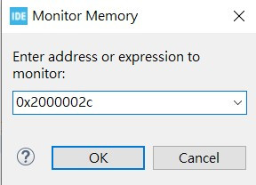

- 接著右邊就會跑出許多框框，預設會是用Hex(十六進位)來表達記憶體的值。右邊New Renderings的地方新增你要解讀這個記憶體的方式

**實際使用看看這個功能：**

- 在全域的地方宣告一個變數x，並用現場表達式的方式獲取他的記憶體位置，以我來說，x這個變數放在0x20000028這個位置(不過實際上是0x20000028~0x2000002B，因為int是四個bytes嘛)

    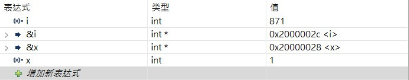

- 接著就按照上面的步驟新增要監看的記憶體位置

    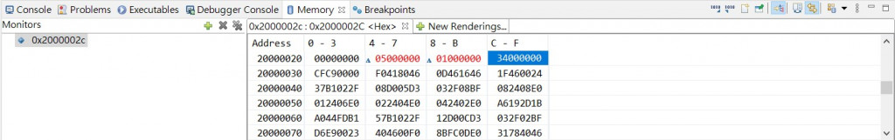

- 選擇Signed Integer作為解讀的方式

    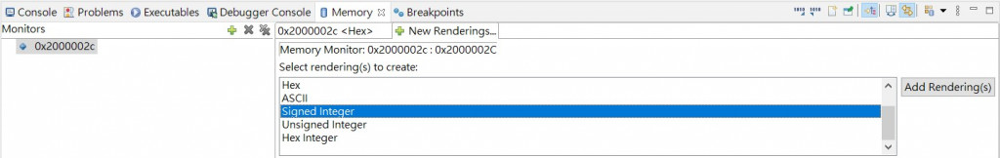

- 就可以順利看到0x20000028~0x2000002B的值啦，並且會以int的方式解讀

    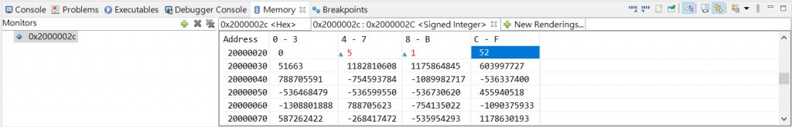

- 我們可以直接更改這個位置的值，直接點你要更改的記憶體位置，輸入新的值就OK了，順便使用現場表達式來確認這個值是否順利地被更動了。我順利的將x更改為31415926~

    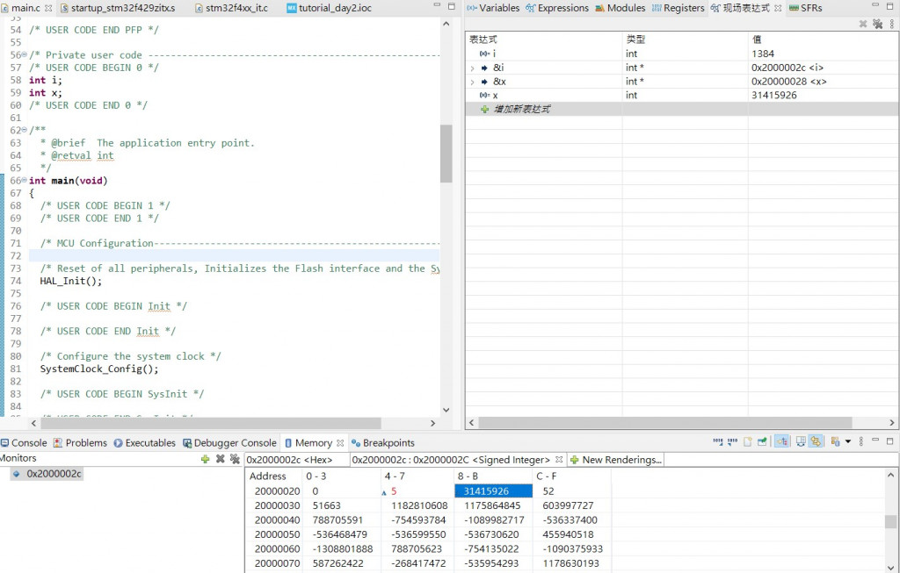

<h1 id="4">GPIO輸入輸出(上)</h1>

- GPIO全稱為General-purpose input/output，通用型之輸入輸出的簡稱，可以供使用者**對腳位進行輸入輸出的操作**。

<h2 id="4.1">腳位</h2>

- 單晶片不外乎就是對各個腳位做輸入輸出來控制馬達、接收訊號等

- 針腳分成內側與外側兩個部分，外側的腳位比較簡單，直接翻到板子的背面就可以看到每個腳位的編號了，而內側的腳位名稱需要查表，看的是紅色箭頭所標示的名稱，未標示的為Arduino的腳位，因為這塊開發版是一塊兼容Arduino的板子，因此他也寫上了對應到Arduino的腳位。

    /STM32_img00.jpg)

    /STM32_img01.jpg)

<h2 id="4.2">ioc檔</h2>

- 設定**腳位配置的圖形化介面**，在左側檔案管理的地方找到filename.ioc(filename為專案名稱)，點擊兩下就會打開。打開後一出現的就是STM32F429ZI單晶片的樣子，我們可以看到他總共有144個腳位

- 右下角的放大鏡可以輸入腳位名稱搜尋，例如輸入PB8對應到的腳位就會閃黑色

    /STM32_img02.jpg)

- 點擊選擇**GPIO_Output**這個模式，就順利的將這個腳位設為輸出模式了

- 如果想要復原，則可以選擇**Reset_State**這個模式，這也有可能需要一點時間，看到腳位就會變綠色就代表成功設定完成

    /STM32_img03.jpg)

- 只要有更動，且還沒有儲存，上面檔案這邊就會顯示" * "，這個時候按ctrl+s就可以順利儲存

    /STM32_img04.jpg)

- 如果有遇到詢問的視窗都一律按Yes，可以打勾，下次就不會再出現提醒了。

    /STM32_img05.jpg)

    /STM32_img06.jpg)

- 最後回到main.c檔案，往下滑我們可以發現自動新增一些程式碼，這段程式碼的功能是將GPIO初始化，這也就是STMCubeIDE這個IDE好用的地方，可以自動產生代碼

    ```C
    /**
    * @brief GPIO Initialization Function
    * @param None
    * @retval None
    */
    static void MX_GPIO_Init(void)
    {
        GPIO_InitTypeDef GPIO_InitStruct = {0};

        /* GPIO Ports Clock Enable */
        __HAL_RCC_GPIOB_CLK_ENABLE();

        /*Configure GPIO pin Output Level */
        HAL_GPIO_WritePin(GPIOB, GPIO_PIN_8, GPIO_PIN_RESET);

        /*Configure GPIO pin : PB8 */
        GPIO_InitStruct.Pin = GPIO_PIN_8;
        GPIO_InitStruct.Mode = GPIO_MODE_OUTPUT_PP;
        GPIO_InitStruct.Pull = GPIO_NOPULL;
        GPIO_InitStruct.Speed = GPIO_SPEED_FREQ_LOW;
        HAL_GPIO_Init(GPIOB, &GPIO_InitStruct);

    }
    ```

<h1 id="5">GPIO輸入輸出(中)</h1>

<h2 id="5.1">GPIO 輸出-LED閃爍</h2>

- 會選PB0是因為STM32F429ZI這塊晶片的**PB0腳**位與USER LED的正極是連通的。因此只要將PB0設為輸出，LED就會亮，可以很直觀的判斷是否成功輸出。

- 這塊開發版上有3個LED分別對應到的腳位為**PB0**、**PB7**、**PB14**

    /STM32_img00.jpg)

**HAL_GPIO_WritePin()**

- 認識學習STM的第二個函式，這個函式的功能就是Arduino的digitalWrite()

    `HAL_GPIO_WritePin(GPIO_TypeDef* GPIOx, uint16_t GPIO_PIN, GPIO_PinState PinState);`

- 假設你要讓PB0腳位輸出高電位：
  - 第一個參數就放GPIOB： **"GPIO"+腳位的英文**
  - 第二個參數放GPIO_PIN_0： **"GPIO_PIN_" +第幾號腳位**
  - 第三個參數若輸出高電位： **GPIO_PIN_SET**, 低電位： **GPIO_PIN_RESET**

    `HAL_GPIO_WritePin(GPIOB, GPIO_PIN_0, GPIO_PIN_SET);`

- 搭配我們先前學過的HAL_Delay()函數，就可以讓LED以1Hz的頻率閃爍

    ```C
    /* USER CODE BEGIN WHILE */
    while (1) {
        /* USER CODE END WHILE */

        /* USER CODE BEGIN 3 */
        HAL_GPIO_WritePin(GPIOB, GPIO_PIN_0, GPIO_PIN_SET);
        HAL_Delay(500);
        HAL_GPIO_WritePin(GPIOB, GPIO_PIN_0, GPIO_PIN_RESET);
        HAL_Delay(500);
    }
    /* USER CODE END 3 */
    ```

**HAL_GPIO_TogglePin()**

- `HAL_GPIO_TogglePin(GPIO_TypeDef* GPIOx, uint16_t GPIO_Pin, GPIO_PinState PinState);`

- 這個函式與剛剛的很像，只不過這個會根據你現在的狀況來做輸出，每次都輸出與現在狀態相反的狀態，例如現在是HIGH則下次輸出LOW，反之亦然。

    ```C
    /* USER CODE BEGIN WHILE */
    while (1) {
        /* USER CODE END WHILE */

        /* USER CODE BEGIN 3 */
        HAL_GPIO_TogglePin(GPIOB, GPIO_PIN_0);
        HAL_Delay(500);
    }
    /* USER CODE END 3 */
    ```

<h2 id="5.2">GPIO - 輸入</h2>

- 要把腳位設定成輸入模式(剛剛是輸出模式)，將.ioc檔內配置將**PF13**腳位配置成輸入模式(**GPIO_Input**)

- 可以設計一個簡單的線路，將剛剛已經設定好的PB0以杜邦線連接到PF13，這樣我們就可以**用PF13來偵測PB0所輸出的腳位**

    /STM32_img01.jpg)

**HAL_GPIO_ReadPin()**

- `HAL_GPIO_ReadPin(GPIO_TypeDef* GPIOx, uint16_t GPIO_Pin);`

- 可以讀取現在輸入是高電位還是低電位

    ```C
    /* USER CODE BEGIN WHILE */
    while (1) {
        /* USER CODE END WHILE */

        /* USER CODE BEGIN 3 */
        HAL_GPIO_TogglePin(GPIOB, GPIO_PIN_0);
        state = HAL_GPIO_ReadPin(GPIOF, GPIO_PIN_13);
        HAL_Delay(500);
    }
    /* USER CODE END 3 */
    ```

- 記得在全域變數宣告一個整數變數state，接著再利用我們之前提到的小工具-現場表達式，就可以看到state的值一直在1和0這兩個數字交替變換

<h1 id="6">GPIO輸入輸出(下)</h1>

- 除了基本的輸入輸出模式之外，事實上輸出有分成兩種，開漏輸出與推挽輸出

<h2 id="6.1">認識電晶體</h2>

- 電晶體很像水關中的閥門，平時處於關閉狀態，施加微小的力，就可以啟動閥門，使大量的水流通過。

    /STM32_img00.jpg)

- 例如：**控制馬達**時，我們不可以用GPIO腳直接供給馬達，因為單晶片是無法通過那麼大的電流，因此我們可以用電晶體的方式，只要提供微小的電流來控制閥門，就可以讓這個水閥通過大電流，使馬達轉動。

- 電晶體有三隻接腳，分別為B(基極)、C(集極)、E(射極)：
  - 電晶體又分成NPN與PNP
  - N型半導體來說，當B極輸入高電位時，C、E兩極導通
  - P型半導體來說，當B極輸入高電位時，C、E兩極不導通

    /STM32_img01.jpg)

<h2 id="6.2">推挽輸出&開漏輸出</h2>

- 實際上的推挽輸出與開漏輸出是使用MOS場效電晶體來設計，下圖是其等效電路

    /STM32_img02.jpg)

**推挽輸出：**

- 當輸出高電位時，上方電晶體導通，下方不導通，此腳位對外輸出高電位；

- 當輸入低電位時，上方電晶體不導通，下方導通，此腳位對外輸出低電位。

**開漏輸出：**

- 上方的電晶體完全不工作

- 如果輸出為0，則下方電晶體導通，腳位被下拉到0V

- 若控制輸出為高電位時，兩個電晶體都關閉，因此腳位不是高電位也不是低電位，為浮動的。

- 因此這種模式下並沒有辦法輸出高電位，需要自己將腳位上拉。

- 由於開漏輸出的高電位是使用外部上拉的方式，因此你可以上拉至任何你想要的電壓，以符合需求，例如某些晶片需要輸入5V，但STM預設的輸出都是3.3V，此時你就可以使用開漏輸出，將腳位上拉至5V。

<h2 id="6.3">輸出設定</h2>

- 實際使用時，可以先將腳位設成GPIO輸出，接著在左側System core底下的GPIO選擇剛剛配置的腳位，底下可以做設定，GPIO mode設為**Output Open Drain**開漏模式

    /STM32_img03.jpg)

- 使用時記得要外部上拉，否則這個腳位是沒辦法輸出高電位的

- 做個小實驗，設成開漏模式時，用電表去測量腳位輸出的變化，當程式輸出高電位時，去測量腳位，應當量到0.xxV，而不是3.3V，此時腳位是浮動的

<h1 id="7">ADC電壓採集</h1>

<h2 id="7.1">類比輸入</h2>

- 自然界當中的訊號幾乎為**連續的**，也就是我們常說的類比訊號

- 對於單晶片或著電腦來說，我們能夠接收的不外乎就是0與1，因此就有了 ADC 的誕生

- **ADC** 全名為 **Analog-To-Digital Converter**，**類比轉數位轉換器**，透過短時間重複採樣，將連續尋號轉換為離散的

**取樣率：**

- 採集的頻率越高，越能完整的描述這個連續的訊號，這也就是**取樣率**的概念

    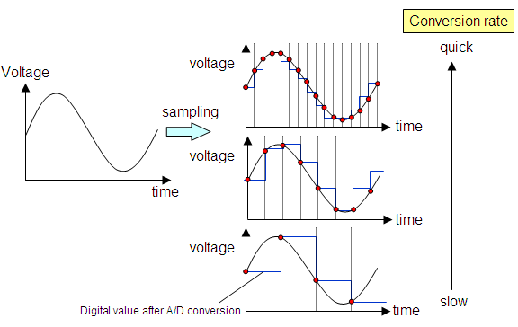

**解析度：**

- 另一個重要的概念就是**解析度**，如果我們能夠將固定的範圍切的更細，那麼我們也就能更好的描述這個類比訊號。

- Arduino使用analogRead他回傳的值為0~1023也就是切成1024等分，我們將其稱為10位元解析度的A/D轉換器(1024為2的10次方)
  - Arduino是將0~5V切成1024等分

- STM32為12的解析度高達12位元，輸出為0~4095，分成4096等分
  - STM32是將0~3.3V分成4096等分
  - 一個等分約為0.806mV

<h2 id="7.2">ADC使用</h2>

- STM32F429ZI單晶片總共有**3個ADC轉換器(ADC1~ADC3)**，而每個轉換器有高達**19個通道**。
  - ADC轉換器就是一台機器，可以將類比訊號轉換為數位訊號
  - 這台機器有19個開口來接收類比訊號(當然一次還是只能接收一個啦)，但這台機器運作的速度非常快(根據我簡單的測量，轉換一次的時間約為11微秒左右)，因此就算你19個通道全部都在輸入，那也只需要11X19=209微秒就可以測量完所有的通道

    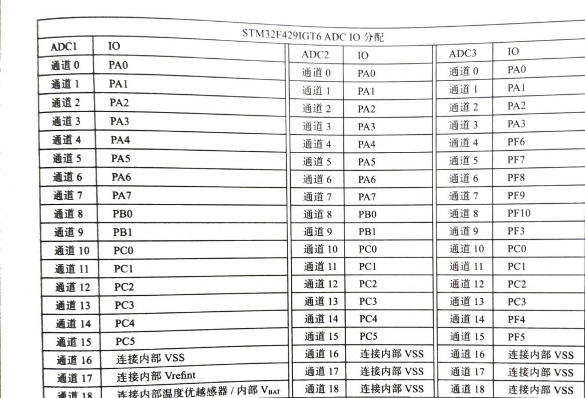

<h2 id="7.3">單通道轉換</h2>

- 進入.ioc檔，選Analog底下的ADC1，右邊出現許多框框勾選IN0，現在我們就已經把ADC1的第一個通道打開了
  - 下滑會發現怎麼只有IN0~IN15，不是說有19個通道嗎?怎麼只有16個呢?其實這塊板子對於外部腳位只有配置16個通道，剩下的3個通道供單晶片內部使用，像是溫度感測等

- 底下的Configuration完全不用配置，都使用預設的即可

- 除了上面所說查表的方式可以知道該通道對應的腳位以外，也可以再Configuration的地方點GPIO Settings，底下的PinName就是腳位名稱

    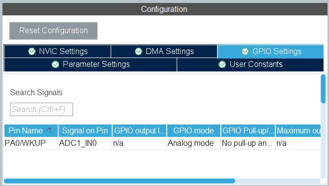

### 使用3個函式來完成ADC的轉換：

**HAL_ADC_Start()：**

- `HAL_ADC_Start(ADC_HandleTypeDef* hadc);`

- 啟用ADC轉換器，就像你要使用一台機器前要先把開關打開的道理相同


**HAL_ADC_PollForConversion()：**

- `HAL_ADC_PollForConversion(ADC_HandleTypeDef* hadc, uint32_t Timeout);`

- **等待轉換完成後再繼續執行程式**

- Timeout這個參數就是告訴這台機器最多要等多久，單位是ms


**HAL_ADC_GetValue：**

- `HAL_ADC_GetValue(ADC_HandleTypeDef* hadc);`

- 回傳轉換的結果

```C
/* USER CODE BEGIN WHILE */
while (1)
{
/* USER CODE END WHILE */

/* USER CODE BEGIN 3 */

    HAL_ADC_Start(&hadc1);
    HAL_ADC_PollForConversion(&hadc1,1);
    value = HAL_ADC_GetValue(&hadc1);
}
```

- 記得在全域宣告一個整數變數value

- 每次轉換前都要將ADC轉換器啟用(只要轉換完成就會關掉，因此要放在while迴圈)。

- 執行後我們就可以用現場表達是來監看轉換完成的value啦

<h1 id="8">STM32記憶體架構</h1>

<h2 id="8.1">為什麼不取 STM31 STM33</h2>

- 因為STM32的CPU為**Cortex-M4**，由**ARM**設計，而這個CPU為**32位元**的處理器。

- **bit** 是內部資料儲存的最小單位，狀態就只有0、1兩種。而我們通常不會只處理一個位元，計算機中資料的處理基本單位為位元組，1byte = 8bit

- **字(word)**，計算機進行資料處理時，一次處理、傳送的長度稱為字

### 匯流排(bus)：

- CPU與各單元、周邊設備溝通時是使用排線所組成的匯流排(bus)

- 一般資料匯流排的大小與位址匯流排的大小是相同的

    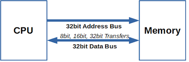

**資料匯流排(data bus)：**

- 32位元處理器就是有32個排線所組成的匯流排(32稱為匯流排寬度，也就是1個word的大小)，一次4bytes的資料。

- 一般來說資料匯流排為**雙向的**，CPU可以傳送資料給記憶體(寫入)，記憶體也可以傳送資料給CPU(讀取)

**位址匯流排(address bus)：**

- 一個處理器寬度為32的匯流排，可定址的大小為2^32，也就是4GB

- 以十六進位表示則為**0x00000000~0xFFFFFFFF**(0x表示以16進位表示法表示)

- 位址匯流排為**單向**，通常只要CPU告訴記憶體你現在所要操作的記憶體位址即可

<h2 id="8.2">記憶體映射</h2>

- 記憶體本身是沒有位址的，記憶體內部就只是一堆半導體元件(AND、OR邏輯閘等)，就好像一個社區，裡面有很多棟房子，起初這些房子是沒有門牌的，且每一棟房子都長一樣，後來才按照順序的幫它編號。

- 實際上我們就是**利用32條線所組成的位址匯流排**，每一根線的**電位高低不同**來為記憶體編號，於是每個記憶體也就有了所謂的**地址**。

- 這裡所說的映射與數學上的映射道理是相同的。在集合論當中，若A中的任一元素x，依照某種規律，必有B中唯一確定的元素與y對應，則稱f是一個從A到B的映射

    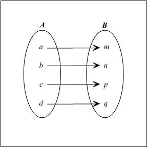

- **要強調的是32的意思是最大可以定址的大小為32bytes，並不代表有這麼大的記憶體**

- 繼續以社區來做舉例，我們可以從1編號到1000，但可能只有其中的1~100、301~400是有對應到房子的。另外稍微想一下，一般筆電差不多是8G的記憶體，如果一個單晶片上有4G的記憶體，那豈不是都快跟電腦一樣了。

<h2 id="8.3">STM32記憶體區域功能劃分</h2>

- 既然沒有這麼大的記憶體，那為什麼我們需要定址到這麼大呢?因為我們並不想讓所有的記憶體位址全部連在一起，通常我們會做初步的分類。下圖稱為記憶體圖(memory map)

    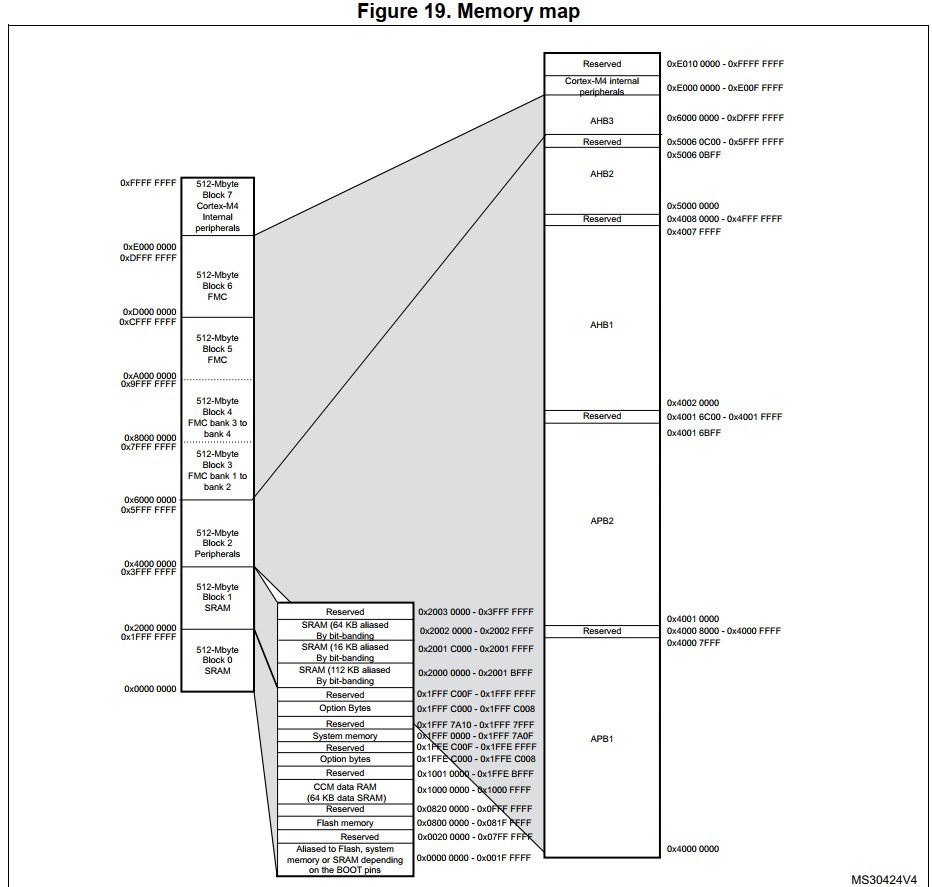

- 在這4GB的地址空間中，大致被分為8塊(Block)，每塊的大小都有512MB

    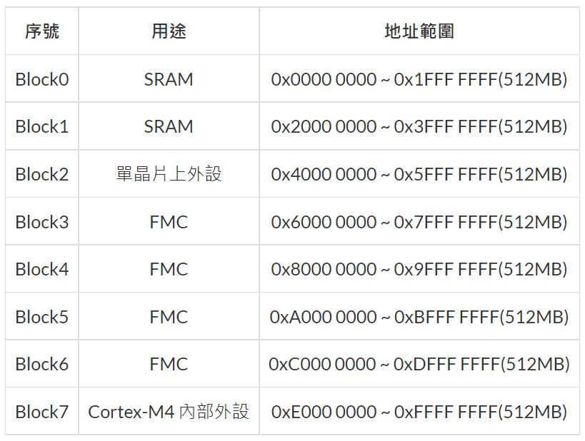

- STM32的記憶體掌握大致分成兩個
  - 快閃記憶體，簡稱Flash：
    - 沒有電源時資料仍然能儲存，這也是我們程式存放的位置
  - 靜態隨機儲存記憶體，簡稱SRAM：
    - 關電會導致資料不見(具有揮發性)

**Flash：**

- Flash的地址範圍是從**0x0800 0000 ~ 0x081F FFFF**，而不同型號的單晶片Flash的大小不同，但**起始位址都是0x0800 0000**，而終點位址則要根據Flash的大小。

- 以F429ZI這塊板子來說，它的Flash大小為2MB，恰好把所有的位址全部用完(也是STM32所有類型的板子中Flash大小最大的，因為再大也沒有編號給它繼續編下去了，所以不可能有更大的Flash)。

**SRAM：**

- F429內部SRAM的大小為256KB
  - 64KB位於**Block0** 的**0x1000 0000 ~ 0x1000FFFF**
  - 192KB位於**Block1**，分為SRAM1 112KB、SRAM2 16KB、SRAM3 64KB。

**Block2：**

- 用於設計單晶片上的外設(後面會在更詳細的介紹外設)，例如管理腳位(腳位就是一種外設)輸出是高電位還是低電位的設定的記憶體就是存放在這裡。

- 根據外設匯流排傳輸速度的不同分為APB與AHB，而APB又分成APB1與APB2;AHB分為AHB1與AHB2

- 實際的存放這些資料的記憶體通常為SDRAM、NORFlash、NANDFlash

- 我們之後在做的任何設定，例如腳位要做高電位輸出還是低電位輸出都是在更動這個地方的記憶體

    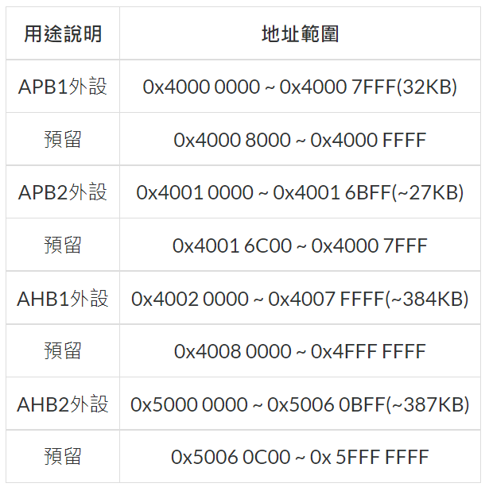

<h1 id="9">庫函數包裝—對於底層暫存器的操縱(上)</h1>

<h2 id="9.1">什麼是暫存器 register?</h2>

- 暫存器顧名思義就是可以存放資料的地方，那也就是記憶體的一種囉? 

- 記憶體Block2這塊區域用來設計單晶片上的外設，他們以4個word為一個單元，共32位(STM32的**資料匯流排寬度為32位**，因此理當**以32位做為一個暫存器**)，每一個單元對應到不同的功能，只要我們**控制這些單元就可以改變外設的行為**。

- C語言的好處是我們可以直接利用**指標**的方式操作這些單元，但如果每次都是用指標的方式，不僅程式碼難以閱讀，每次寫程式的時候還要去翻閱資料，看某一個單元的地址為何。

- 因此我們會以功能來命名這些記憶體，這個別名就是我們常說的暫存器，而將已配好地址、有特定功能的記憶體取別名的過程就叫做**暫存器映射**

    [STM32F4xx中文參考手冊](./doc/庫函數包裝—對於底層暫存器的操縱(上)/STM32F4xx中文参考手册.pdf)

<h2 id="9.2">外設地址映射</h2>

- 單晶片上外設分為4條總線，根據外設速度不同，不同匯流排掛載著不同的外設

- APB掛載低速設備，AHB掛載高速設備

- 每一個匯流排的最低地址被稱為該匯流排的**基地址**

- 匯流排上掛載著各種外設，這些外設也有自己的地址範圍，特定外設的首個地址稱為XX外設基地址

**以GPIO來講解：**

- 從下表我們可以看到GPIOA的基地址相對於AHB1匯流排的地址偏移為0，也就是AHB1的第一個外設就是GPIOA

    /STM32_img00.png)

- 處於XX外設的地址範圍內的就是該外設的暫存器。

- 以GPIO外設為例，GPIO有很多暫存器，每一個都有特定的功能。每個暫存器為32位，在該外設的基地址上按照順序排列，暫存器的位置都以相對於外設基地址的偏移來描述。

- 以GPIOH端口為例，來了解GPIO實際上到底有那些暫存器。

    /STM32_img01.png)

- 這裡我們以GPIO端口置位/復位暫存器為例(GPIOx_BSRR)，介紹如何理解暫存器的說明

    /STM32_img02.jpg)

  1. **暫存器的名稱**

  2. **偏移地址**： 指此暫存器相對於這個外設的基地址

        Note：例如這個暫存器的偏移地址是0x18，GPIOA外設的基地址是0x4002 0000，於是可以算出GPIOA的GPIOA_BSRR暫存器的位置為：0x4002 0418

  3. **暫存器位表**： 列出0~31位的名稱和權限。
    上方的數字為編號，中間為位名稱，最下方為讀寫權限。
    r代表只讀、w代表只寫、rw表示可讀可寫。

  4. **位功能說明**： 本暫存器有兩種暫存器位，BRy及BSy，其中y數值為0~15，如BR0、BS0用於控制GPIOx的第0個腳

<h1 id="10">庫函數包裝—對於底層暫存器的操縱(下)</h1>

<h2 id="10.1">C語言對暫存器的封裝</h2>

### 1. 封裝匯流排和外設基地址

- 為了方便使用者理解和記憶，我們把**匯流排基地址**和**外設基地址**都以**define**的方式來定義。

- 在`stm32f429xx.h`當中可以看到：
    - 數字後面的"UL"是後綴，代表unsigned longlong

    ```C
    /* 外設基地址 */
    #define PERIPH_BASE           0x40000000UL

    /* 總線基地址 */
    #define APB1PERIPH_BASE       PERIPH_BASE
    #define APB2PERIPH_BASE       (PERIPH_BASE + 0x00010000UL)
    #define AHB1PERIPH_BASE       (PERIPH_BASE + 0x00020000UL)
    #define AHB2PERIPH_BASE       (PERIPH_BASE + 0x10000000UL)

    /* GPIO 外設基地址 */
    #define GPIOA_BASE            (AHB1PERIPH_BASE + 0x0000UL)
    #define GPIOB_BASE            (AHB1PERIPH_BASE + 0x0400UL)
    #define GPIOC_BASE            (AHB1PERIPH_BASE + 0x0800UL)
    #define GPIOD_BASE            (AHB1PERIPH_BASE + 0x0C00UL)
    #define GPIOE_BASE            (AHB1PERIPH_BASE + 0x1000UL)
    #define GPIOF_BASE            (AHB1PERIPH_BASE + 0x1400UL)
    #define GPIOG_BASE            (AHB1PERIPH_BASE + 0x1800UL)
    #define GPIOH_BASE            (AHB1PERIPH_BASE + 0x1C00UL)
    #define GPIOI_BASE            (AHB1PERIPH_BASE + 0x2000UL)
    #define GPIOJ_BASE            (AHB1PERIPH_BASE + 0x2400UL)
    #define GPIOK_BASE            (AHB1PERIPH_BASE + 0x2800UL)
    ```

### 2. 封裝暫存器列表

- 既然GPIOA~GPIOK功能都是相似的，底下又有那麼多暫存器，那我們應該用**struct的方式來對這些資料做包裝**啊，於是就有了底下的定義：

- 以結構體的方式來使用暫存器，增加可讀性

    ```C
    typedef struct
    {
        __IO uint32_t MODER;    /*!< GPIO 模式暫存器           Address offset: 0x00      */
        __IO uint32_t OTYPER;   /*!< GPIO 輸出類型暫存器       Address offset: 0x04      */
        __IO uint32_t OSPEEDR;  /*!< GPIO 輸出速度暫存器       Address offset: 0x08      */
        __IO uint32_t PUPDR;    /*!< GPIO 上拉/下拉暫存器      Address offset: 0x0C      */
        __IO uint32_t IDR;      /*!< GPIO 輸入數據暫存器       Address offset: 0x10      */
        __IO uint32_t ODR;      /*!< GPIO 輸出數據暫存器       Address offset: 0x14      */
        __IO uint32_t BSRR;     /*!< GPIO 置位/復位暫存器      Address offset: 0x18      */
        __IO uint32_t LCKR;     /*!< GPIO 配置鎖定暫存器       Address offset: 0x1C      */
        __IO uint32_t AFR[2];   /*!< GPIO 富用功能配置暫存器   Address offset: 0x20-0x24 */
    } GPIO_TypeDef;
    ```

- 簡化一下名稱，以GPIOx的方式直接獲取GPIOx的基位址

    ```C
    #define GPIOA               ((GPIO_TypeDef *) GPIOA_BASE)
    #define GPIOB               ((GPIO_TypeDef *) GPIOB_BASE)
    #define GPIOC               ((GPIO_TypeDef *) GPIOC_BASE)
    #define GPIOD               ((GPIO_TypeDef *) GPIOD_BASE)
    #define GPIOE               ((GPIO_TypeDef *) GPIOE_BASE)
    #define GPIOF               ((GPIO_TypeDef *) GPIOF_BASE)
    #define GPIOG               ((GPIO_TypeDef *) GPIOG_BASE)
    #define GPIOH               ((GPIO_TypeDef *) GPIOH_BASE)
    #define GPIOI               ((GPIO_TypeDef *) GPIOI_BASE)
    #define GPIOJ               ((GPIO_TypeDef *) GPIOJ_BASE)
    #define GPIOK               ((GPIO_TypeDef *) GPIOK_BASE)
    ```

<h2 id="10.2">HAL_GPIO_WritePin()做了哪些事?</h2>

- stm32幾乎都把所有參數都用define的方式來定義增加可讀性

- GPIO_Pin，以及GPIO_PinState的定義：

**GPIO_Pin：**

- 一次就是只有一個bit會是1，這樣就可以用每個位元來代表pin0~15剛好16個位元!

- 而最後一個GPIO_PIN_ALL 對應到0xffff轉換成二進位就是每個位元都是1

    ```
    GPIO_PIN_1 對應到0x0002 = 0b 0000 0000 0000 0010
    GPIO_PIN_2 對應到0x0004 = 0b 0000 0000 0000 0100
    GPIO_PIN_3 對應到0x0008 = 0b 0000 0000 0000 1000
    GPIO_PIN_4 對應到0x0010 = 0b 0000 0000 0001 0000
    ```

    ```C
    #define GPIO_PIN_0                 ((uint16_t)0x0001)  /* Pin 0 selected    */
    #define GPIO_PIN_1                 ((uint16_t)0x0002)  /* Pin 1 selected    */
    #define GPIO_PIN_2                 ((uint16_t)0x0004)  /* Pin 2 selected    */
    #define GPIO_PIN_3                 ((uint16_t)0x0008)  /* Pin 3 selected    */
    #define GPIO_PIN_4                 ((uint16_t)0x0010)  /* Pin 4 selected    */
    #define GPIO_PIN_5                 ((uint16_t)0x0020)  /* Pin 5 selected    */
    #define GPIO_PIN_6                 ((uint16_t)0x0040)  /* Pin 6 selected    */
    #define GPIO_PIN_7                 ((uint16_t)0x0080)  /* Pin 7 selected    */
    #define GPIO_PIN_8                 ((uint16_t)0x0100)  /* Pin 8 selected    */
    #define GPIO_PIN_9                 ((uint16_t)0x0200)  /* Pin 9 selected    */
    #define GPIO_PIN_10                ((uint16_t)0x0400)  /* Pin 10 selected   */
    #define GPIO_PIN_11                ((uint16_t)0x0800)  /* Pin 11 selected   */
    #define GPIO_PIN_12                ((uint16_t)0x1000)  /* Pin 12 selected   */
    #define GPIO_PIN_13                ((uint16_t)0x2000)  /* Pin 13 selected   */
    #define GPIO_PIN_14                ((uint16_t)0x4000)  /* Pin 14 selected   */
    #define GPIO_PIN_15                ((uint16_t)0x8000)  /* Pin 15 selected   */
    #define GPIO_PIN_All               ((uint16_t)0xFFFF)  /* All pins selected */
    ```

**GPIO_PinState：**

- GPIO_PIN_RESET代表0，而GPIO_PIN_SET代表1

    ```C
    typedef enum
    {
        GPIO_PIN_RESET = 0,
        GPIO_PIN_SET
    }GPIO_PinState;
    ```

**函式的API：**

```C
void HAL_GPIO_WritePin(GPIO_TypeDef* GPIOx, uint16_t GPIO_Pin, GPIO_PinState PinState)
{
    /* Check the parameters */
    assert_param(IS_GPIO_PIN(GPIO_Pin));
    assert_param(IS_GPIO_PIN_ACTION(PinState));

    if(PinState != GPIO_PIN_RESET)
    {
        GPIOx->BSRR = GPIO_Pin;
    }
    else
    {
        GPIOx->BSRR = (uint32_t)GPIO_Pin << 16U;
    }
}
```

<h1 id="11">NVIC中斷概要</h1>

- STM32的中斷很強大，每個外設都可以產生中斷

<h2 id="11.1">中斷是什麼?</h2>

- **NVIC**全稱為**Nested Vectored Interrupt Controller**，中文譯為**嵌套向量中斷控制器**。

- 中斷就是**假設你在做某件事的過程當中，有另一件事更重要必須要先做，你就會中斷你現在正在做的事，先去做其他事，做完再回來**，理想上應將程式分配在中斷當中執行，這樣可以更好的做到任務的排程。

- STM32甚至可允許巢狀中斷，也就是在中斷的時候還可以再中斷。

<h2 id="11.2">優先級定義</h2>

- 假如有兩個地方同時發起中斷請求，這個時候就必須決定要先做哪一個

- 優先級的分組是由**中斷優先級暫存器NVIC_IPRX**(在F429中，x=0~90)來配置外部中斷的優先級，原則上每個外部中斷可配置的優先級為0~255，數值越小優先級越高。但是因為精簡化的設計，實際上支持的優先級會減少，在F429中，只使用了bit4~bit7

    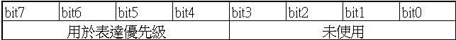

<h2 id="11.3">優先級分組</h2>

- 表達優先級的那四個bit，又被分成**搶暫優先級(主優先級)**與**子優先級**。

- 如果有許多中斷同時發起請求，**主優先級高**的就會搶暫主優先級低的優先執行，如果主優先級相同則先比**子優先級**，如果兩個優先級都相同，就比較他們的**中斷編號**，編號小的優先執行。

    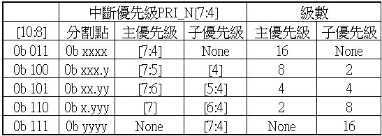

- 點選system core底下的NVIC進行配置，預設情況下分組方式4個bit全部都給搶暫優先級(主優先級(Preemption Priority))，沒有子優先級(Sub Priority)。

    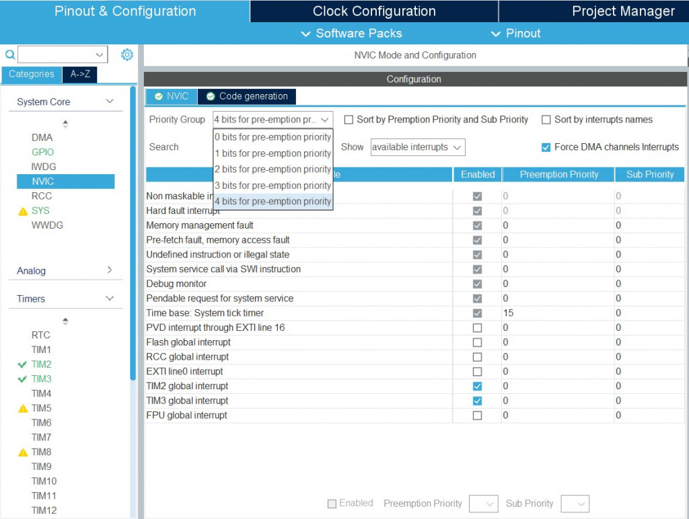

<h1 id="12">EXTI外部中斷&事件控制器</h1>

<h2 id="12.1">外部中斷</h2>

- 各種外設都可以有中斷

- 是一種比較簡單的中斷

- 外部中斷顧名思義就是**在外部來發起中斷請求**，例如用一個按鈕連接到腳位，當按鈕按下時，腳位產生電位的變化，就可以透過按鈕來發起中斷。

- STM32進入中斷的時機有兩種： 都屬於**邊緣檢測**，也就是只有在電位改變時才會檢測到
    - 一種是低電位變高電位時，也就是電位上升的過程(**上升緣檢測**)
    - 另一種是高電位變低電位時，也就是電位下降的過程(**下降緣檢測**)

    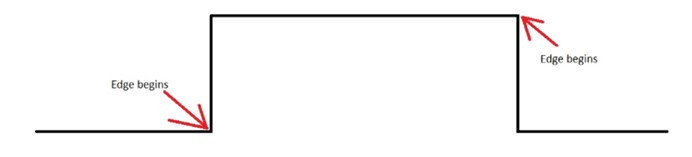

<h2 id="12.2">實作-利用開發版上的按鈕執行外部中斷</h2>

- 開發版上已經有現成的按鈕可以使用，不必自己在接線路，非常方便。

    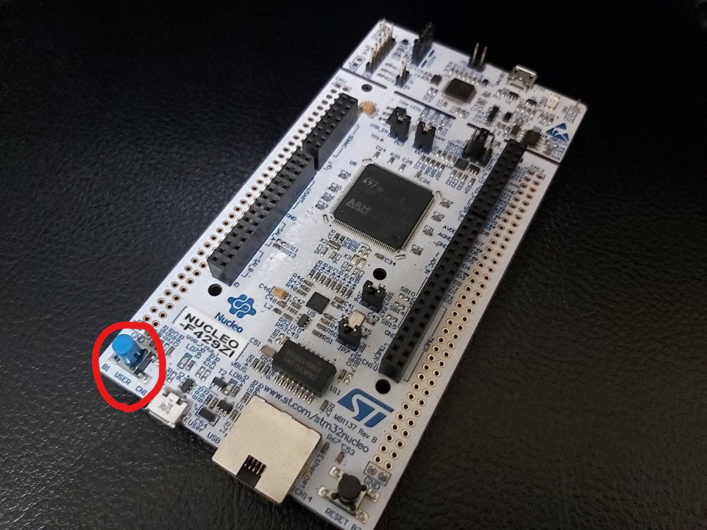

- 由datasheet可以知道，按鈕是連接在**PC13**腳位上。也就是說當你按下按鈕後，PC13就會輸入高電位，而放開則為低電位。我們就可以利用按鈕來讓電位從低變高(上升緣)，從而觸發中斷。

**實際設定：**

1. 先將PC13腳位設為**GPIO_EXTI_13**

    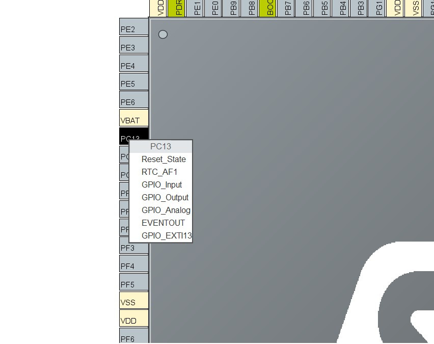

2. 接著可以在System Core 內的 GPIO選擇剛剛的PC13腳位來設定**GPIO mode**，可以設定**觸發中斷的時機**

    

3. 接著在NVIC的地方將剛剛腳位的中斷設為**Enabled**

    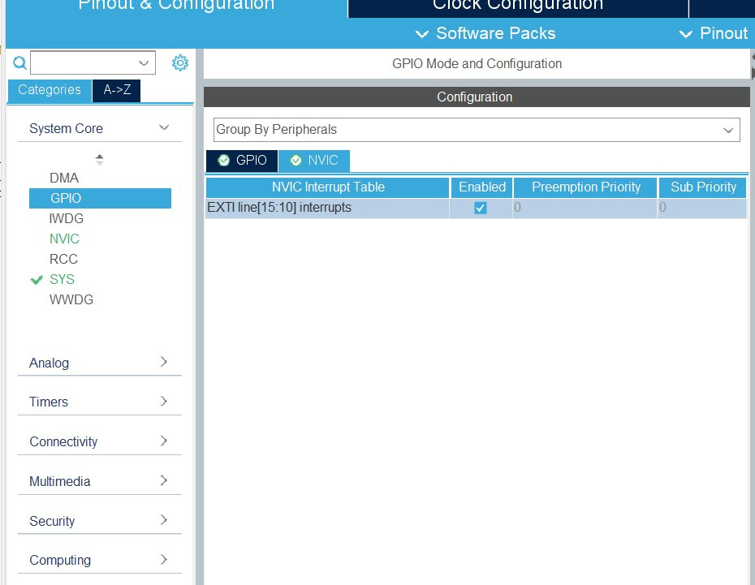

**外部中斷觸發的函式：**

```C
/*Driver/STM32F4xx_HAL_Driver/Src/stm32f4xx_hal_gpio.c*/
__weak void HAL_GPIO_EXTI_Callback(uint16_t GPIO_Pin)
{
    /* Prevent unused argument(s) compilation warning */
    UNUSED(GPIO_Pin);
    /* NOTE: This function Should not be modified, when the callback is needed,
            the HAL_GPIO_EXTI_Callback could be implemented in the user file
    */
}
```

- 「觸發這個函式」的意思就是呼叫這個函式，當按鈕按下時，腳位偵測到上升緣，就會進行中斷觸發，

- 函式的開頭有**__weak**，用在函式前，代表這個函式是弱定義，當你的程式碼其他地方有對這個函式就其他地方做定義，就會以新的定義為主。由於不熟悉的人很難記住函式的API，因此你可以先到gpio.c當中找到這些程式碼，直接複製到main.c當中，就可以直接使用了

    ```C
    void HAL_GPIO_EXTI_Callback(uint16_t GPIO_Pin)
    {
        /* Prevent unused argument(s) compilation warning */
        if(GPIO_Pin == GPIO_PIN_13){
            x = (x == 0)? 1:0;
        }
    }
    ```

- 記得在全域設一個變數x，這段函式可以放在程式碼任何一個位置，我通常會放在 USER CODE BEGIN/END 4 之間

- 在EXTI模式當中，你只能用**數字不同的腳位**，例如PE9,PC9不可同時都為EXTI模式，一次只能有一個，從他的中斷函式也可以知道，他的參數只有GPIO_PIN，他只知道數字多少，而不知道英文(A~F)哪一個。

- 若你有很多的外部中斷，你就可以用**if-else**的方式來決定哪一個腳位的中斷要做什麼事。

<h1 id="13">STM32輾壓Arduino的功能—TIM(上)</h1>

<h2 id="13.1">計時器 TIMER</h2>

- STM32F429ZI總共有14個計時器，這14個大致可以分為三種：
    - 通用定時器
    - 基本定時器
    - 高級定時器

    /STM32_img00.png)

<h2 id="13.2">計數器 counter</h2>

- 顧名思義就是一個計數的工具，他會從0開始往上數，只要到達設定的上限，他就會歸零，並且重新計數。

- 不同的TIMER支援的counter有所不同，可以看上面的表格，有些可以設定**往上數(count-up)**，或 **往下數(count-down)** 或 **先往上數再往下數(count-down)** 稱作中心對齊模式。

<h2 id="13.3">PSC & ARR讓你的時鐘可快可慢</h2>

- 每一個timer都需要有一個時鐘來源，我們暫時先記得timer1、8、9、10、11是來自APB1匯流排，其他的都是來自APB2

- 兩個匯流排的頻率在預設的情況下都是**16MHz**，可以在Clock configuration裡面看到

    /STM32_img01.jpg)

**參數：**

**1. 分頻數(Prescaler)：**

- 由於STM32的時鐘預設是16MHz速度，太快了，我們難以使用，因此也就有了分頻係數(Prescalar)的產生，分頻就是將原來的頻率降低為原來的1/N

- STM所有時鐘的分頻係數皆為1~65536，但這裡要注意，設定時的數值為(0~65535)，當設為0時分頻係數為1，頻率不變

**2. 數週期(counter period)：**

- 又稱為自動重載暫存器Auto reload register(ARR)

- 當這個計數器數到這個數字時會自動歸零，例如當你設為1000時，counter會從0~999，不會有1000

**實際操作：**

- 設定.ioc檔

  1. 在Timers的選單裡面選TIM2，在Clock source裡面選**Internal clock**

        /STM32_img02.jpg)

  2. 底下參數的配置就調整**PSC**以及**ARR**，我們先把PSC設為15999，也就是分頻數為16000讓時鐘的頻率由原本的16MHz變為1kHz，而ARR設為10000，只要數到10000，就會歸零(不會出現1000這個數字)。

        /STM32_img03.png)

- 程式

    ```C
    /* USER CODE BEGIN 2 */
    HAL_TIM_Base_Start(&htim2);
    /* USER CODE END 2 */

    /* Infinite loop */
    /* USER CODE BEGIN WHILE */
    while (1)
    {
        x = __HAL_TIM_GET_COUNTER(&htim2);
    /* USER CODE END WHILE */

    /* USER CODE BEGIN 3 */
    }
    /* USER CODE END 3 */
    ```

  - 一樣要記得設全域變數 x 才能使用現場表達式做監測

  1. **HAL_TIM_Base_Start(TIM_HandleTypeDef *htim)**
     - 看到類似這種的函式HAL_XXX_Start，這種函式功能為讓某種功能啟用
     - 他就是讓TIMER開始計數

  2. **__HAL_TIM_GET_COUNTER()**


