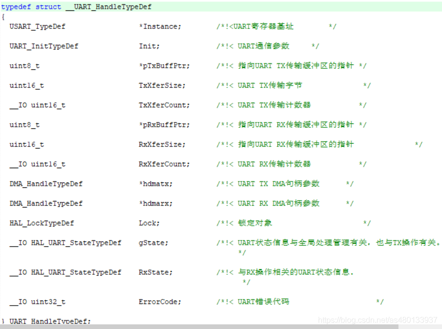
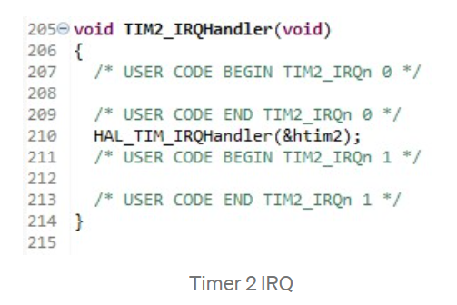
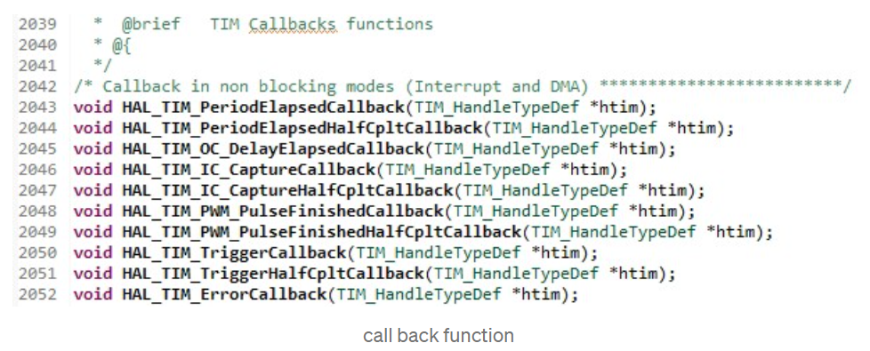
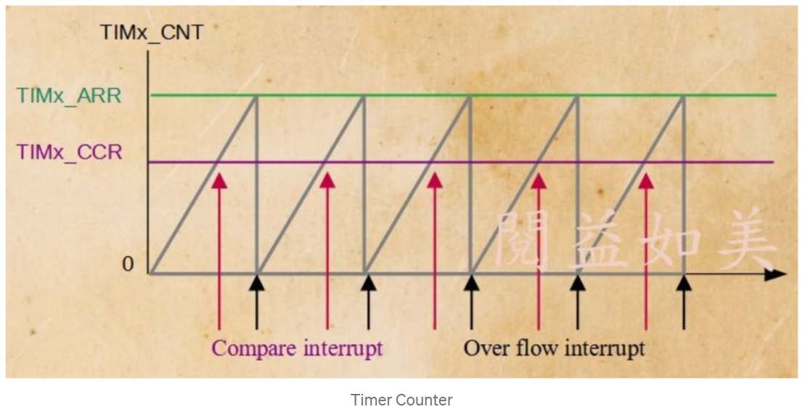
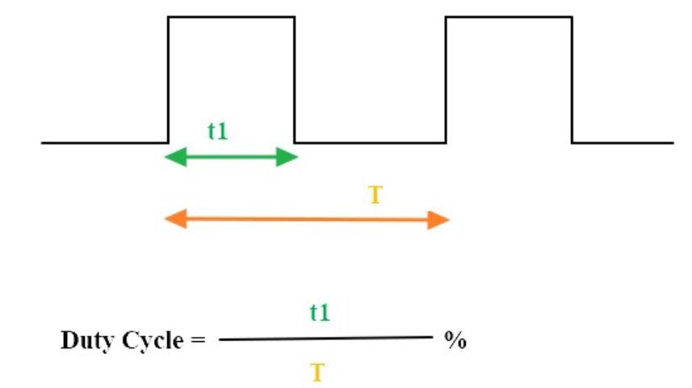
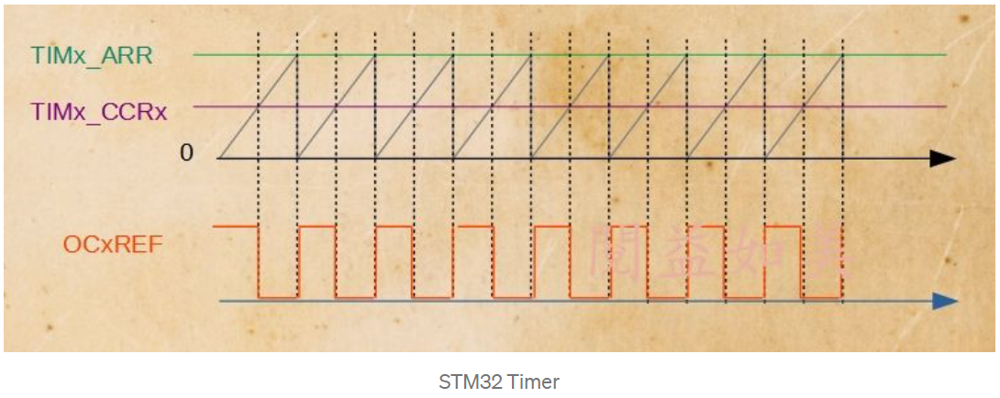
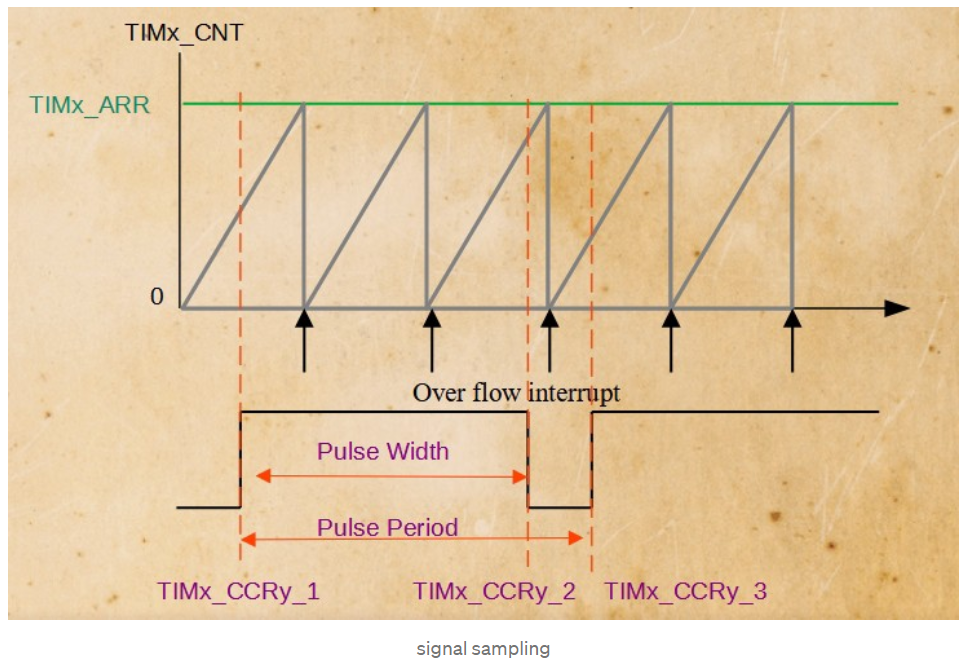

# 目錄

- [Reference](#0)
  - [STM32開發之串口講解](#0.1)
    - [通信方式](#0.1.1)
    - [串行通信的傳送方式](#0.1.2)
- [GPIO](#1)
  - [[STM32G4系列] GPIO筆記 - CubeMX GPIO整理與應用](#1.1)
    - [設定GPIO output](#1.1.1)
    - [設定GPIO input](#1.1.2)
    - [STM32的HAL庫中GPIO有8種工作模式](#1.1.3)
  - [[STM32系列] GPIO應用篇- 7 segment led display](#1.2)
    - [認識七段顯示器](#1.2.1)
    - [實際操作](#1.2.2)
- [I2C](#2)
  - [[STM32系列] IC之間常用的通訊協定 I²C](#2.1)
  - [[STM32系列] 16 x 2 LCD 液晶顯示器 with I²C](#2.2)
    - [LCD 1602 display](#2.2.1)
    - [PCF8574](#2.2.2)
    - [連接PCF8574到LCD、STM32 Board](#2.2.3)
  - [[STM32系列] DHT11 溫溼度感測模組](#2.3)
    - [DHT-11 模組數位溫濕度感測器](#2.3.1)
    - [DHT-11 初始化](#2.3.2)
- [UART](#3)
  - [[STM32系列] 串列通訊的老祖宗：UART](#3.1)
  - [[STM32系列] UART/USART TX 資料傳送篇](#3.2)
    - [UART 串列傳送分成三種模式](#3.2.1)
  - [HAL庫UART函數庫介紹](#3.3)
    - [UART結構體定義](#3.3.1)
- [Timer](#4)
  - [Basic](#4.1)
    - [計數原理](#4.1.1)
    - [HAL 函式庫](#4.1.2)
  - [Interrupt](#4.2)
    - [HAL 函式庫](#4.2.1)
  - [Output_Compare](#4.3)
    - [HAL 函式庫](#4.3.1)
  - [PWM](#4.4)
    - [HAL 函式庫](#4.4.1)
  - [Input_Capture](#4.5)


<h1 id="0">Reference</h1>

- [初次學習的學習清單](https://ithelp.ithome.com.tw/articles/10281160)

- https://ithelp.ithome.com.tw/users/20141979/articles?page=4

- [HAL庫](https://doc.embedfire.com/products/link/zh/latest/tutorial/ebf_stm32_hal_tutorial.html)


<h2 id="0.1">STM32開發之串口講解</h2>

[Reference](https://zhuanlan.zhihu.com/p/368775649)

<h3 id="0.1.1">通信方式</h3>

- 處理器和外部設備進行通信的方式大體分為兩種：**並行通信**、**串行通信**
  - 並行通信：

    ```
    傳輸原理：數據各個位同時傳輸

    優點：速度快

    缺點：佔用資源多
    ```

  - 串行通信：

    ```
    傳輸原理：數據的按位順序傳輸 101000111

    優點：佔用引腳資源少

    缺點：速度慢
    ```

<h3 id="0.1.2">串行通信的傳送方式</h3>

- 按照傳送方向劃分，分為三種
  - **單工**： 數據傳輸只支持在一個方向傳輸
  - **半雙工**： 數據允許在兩個方向上傳輸，但是某一個時刻只支持在一個方向傳輸，其實就是一種切換方向的單工通信
  - **全雙工**： 數據允許同時在兩個方向上傳輸，其實就是兩個單工通信的結合，要求設備有接收和發送功能

- 串行通信又可以分為
  - **同步通信**： 帶時鐘同步信號 如 IIC 和 SPI
  - **異步通信**： 不帶時鐘同步信號 如 UART （異步通用收發器）


<h1 id="1">GPIO</h1>

<h2 id="1.1">[STM32G4系列]GPIO筆記-CubeMX GPIO整理與應用</h2>

[Reference](https://ithelp.ithome.com.tw/articles/10282215)

<h3 id="1.1.1">設定GPIO output</h3>

- 以P2腳位PC13為例，設定為GPIO輸出腳位

- 在MCU接腳圖點選**GPIO_Output**，可在左邊**System Core**選項中開啟**GPIO視窗**，可顯現所設定腳位詳細資料

    

- 可在User Label可自行定義名稱

    

- 若沒有特殊要求，甚至User Label亦可選擇默認，即完成CubeMX中 GPIO的配置

**指令函數使用：**

1. 使GPIO輸出高電平或低電平：`void HAL_GPIO_WritePin(GPIO_TypeDef *GPIOx, uint16_t GPIO_Pin, GPIO_PinState PinState)`
   - **GPIOx** :其中x可以(A..G取決於所使用的裝置)來選擇GPIO外設
   - **GPIO_Pin** :指定要寫入的埠位。此引數可以是GPIO_PIN_x之一，其中x可以是( 0..15 )
   - **PinState** :指定要寫入選定位的值。此引數可以是GPIO_PinState列舉值之一:
     - **GPIO_PIN_RESET**:清除埠Pin,低電平
     - **GPIO_PIN_SET**:設定埠Pin，高電平

    ```C
    HAL_GPIO_WritePin(GPIOA, DONG_OUT_1_Pin|DONG_OUT_2_Pin, GPIO_PIN_RESET);//兩個設定為低電平
    HAL_Delay(1000);//1s
    HAL_GPIO_WritePin(GPIOA, DONG_OUT_1_Pin, GPIO_PIN_SET);//單獨設定為高電平
    HAL_GPIO_WritePin(GPIOA,DONG_OUT_2_Pin, 1);//單獨設定為高電平
    HAL_Delay(1000);//1s
    ```

2. Toggle指定的GPIO output：`void HAL_GPIO_TogglePin(GPIO_TypeDef *GPIOx, uint16_t GPIO_Pin)`
   - **GPIOx** :其中x可以(A..G取決於所使用的裝置)來選擇GPIO外設
   - **GPIO_Pin** :指定要寫入的埠位。此引數可以是GPIO_PIN_x之一，其中x可以是(0..15 )

    ```C
    HAL_GPIO_TogglePin(GPIOA, DONG_OUT_1_Pin|DONG_OUT_2_Pin);//兩個輸出電平取反
    HAL_Delay(1000);//1s
    HAL_GPIO_TogglePin(GPIOA, DONG_OUT_1_Pin);//單獨輸出電平取反
    HAL_GPIO_TogglePin(GPIOA,DONG_OUT_2_Pin);//單獨輸出電平取反
    HAL_Delay(1000);//1s
    ```

<h3 id="1.1.2">設定GPIO input</h3>

- GPIO intput使用可以分成兩種方式達成，分別是**輪詢**與**中斷**方式

**輪詢：**

- 使GPIO讀取腳位高電平或低電平：`GPIO_PinState HAL_GPIO_ReadPin(GPIO_TypeDef *GPIOx, uint16_t GPIO_Pin)`
  - **GPIOx** :其中x可以(A..G取決於所使用的裝置)來選擇GPIO外設
  - **GPIO_Pin** :指定要寫入的埠位。此引數可以是GPIO_PIN_x之一，其中x可以是(0..15 )

- 返回：

    ```C
    typedef enum
    {
        GPIO_PIN_RESET = 0u,    //低電平
        GPIO_PIN_SET            //高電平
    } 
    GPIO_PinState;
    ```

- 範例：

    ```C
    GPIO_PinState res=HAL_GPIO_ReadPin(DONG_IN_1_GPIO_Port,DONG_IN_1_Pin);          //讀取電平
    if(res==GPIO_PIN_RESET)
    {
        HAL_GPIO_WritePin(GPIOA, DONG_OUT_1_Pin|DONG_OUT_2_Pin, GPIO_PIN_SET);      //兩個設定為高電平
    }
    else
    {
        HAL_GPIO_WritePin(GPIOA, DONG_OUT_1_Pin|DONG_OUT_2_Pin, GPIO_PIN_RESET);    //兩個設定為低電平
    }
    ```

**中斷：**

- 以CubeMX設定GPIO

    

    

- GPIO mode:
  - 上升沿觸發檢測的外部中斷模式（External Interrupt Mode with Rising edge trigger detection）
  - 下降沿觸發檢測的外部中斷模式（External Interrupt Mode with Falling edge trigger detectiort）
  - 上升/下降沿觸發檢測的外部中斷模式（External Interrupt Mode with Risinq/Falling edge trigger detection）
  - 上升沿觸發檢測的外部事件模式（External Event Mode with Rising edge trigger detection）
  - 下降沿觸發檢測的外部事件模式（External Event Mode with Falling edge trigger detection）
  - 上升/下降沿觸發檢測的外部事件模式（External Event Mode with Rising/Falling edge trigger detectiont）

- 中斷和事件的區別：
  - **中斷**是當IO達到中斷條件後會向CPU產生中斷請求
  - **事件**是事先設定好的任務，當微控制器達到要求將通過硬體的方式處理事先設定好的任務，而不向CPU請求中斷，比如DMA、AD轉換等

- 範例：

    ```C
    //GPIO中斷回撥函式
    void HAL_GPIO_EXTI_Callback(uint16_t GPIO_Pin){
    //判斷進入中斷的GPIOs
    if(KEY1_Pin==GPIO_Pin){
            HAL_GPIO_TogglePin(GPIOA, DONG_OUT_1_Pin);      //單獨輸出電平取反
            HAL_GPIO_TogglePin(GPIOA,DONG_OUT_2_Pin);       //單獨輸出電平取反
        }
    }
    ```

<h3 id="1.1.3">STM32的HAL庫中GPIO有8種工作模式</h3>


**4種輸入狀態**

1. 浮空輸入模式

   - STM32的引腳狀態是不確定的，此時STM32得到的電平狀態完全取決於GPIO外部的電平狀態，所以說在GPIO外部的引腳懸空時，讀取該埠的電平狀態是個不確定的值。

2. 模擬輸入模式

   - 最常用的場合是ADC模擬輸入，不像其他輸入模式只有0和1，模擬輸入模式可以讀取到很細微變化的值

3. 帶上拉、下拉輸入模式

   - 上下拉的電阻的介紹是電阻阻值都在30-50K之間

   - 因為浮空模式時，在GPIO外部連接的電路未工作時，STM32讀取的GPIO狀態是不確定的，所以可以採用帶上拉或者下拉輸入的模式先給MCU一個確定的狀態，當外部電路電平狀態發生變化時，易於MCU的判斷。

**4種輸出狀態**

1. 推輓輸出模式

   - 指兩個三極體分別受兩個互補信號的控制
   - 總是在一個三極體導通的時候另一個截止
   - 可以輸出高電平，也可以輸出低電平


2. 開漏輸出模式

   - 一般開漏輸出模式時，如果外部不接上拉電阻時，只能輸出低電平
   - 想輸出高電平必須要外接上拉電阻

3. 復用推挽、開漏輸出模式

   - 可以理解為把GPIO配置為第二功能使用的時候的配置，並非單純的用作IO輸入或輸出
   - 使用外設IIC時，我們需要把GPIO配置為復用推輓輸出，用於數據通信功能
   - 串口通信的TX、以及SPI外設的GPIO使用就要把引腳設置為復用開漏輸出

<h2 id="1.2">[STM32系列] GPIO應用篇- 7 segment led display</h2>

[Reference](https://ithelp.ithome.com.tw/articles/10243426)

<h3 id="1.2.1">認識七段顯示器</h3>

- 七段顯示器是由**8個LED**組合而成，從最上方順時鐘數依序命名 a, b, c, d, e, f,以及小數點dp，中間上下兩隻腳是連通的

    

- 七段顯示器一般分共陰和共陽：
    - **共陽**：指內部8個LED正極接一起，當**任意腳電位為Low**，LED導通，共陽**0亮1不亮**
    - **共陰**：指內部8個LED負極接一起，當**任意腳電位為High**，LED導通，共殷**1亮0不亮**

    

<h3 id="1.2.2">實際操作</h3>

- 將四個七段顯示器包裝在一起，繼承原本abcdefg接腳，還多了D0,D1,D2,D3，當其中D0,D1,D2,D3任一位數接地，相對應的位數就會發亮

    

**Pinout：**

- RCC → HSE、LSE → Crystal/Ceramic Resonator✅
- SYS → Debug Serial Wire ✅

- PA0 ~ PA7 → GPIO_Output (作為七段顯示器的abcdefg和dp小數點)
- PB0 ~ PB3 → GPIO_Output (作為七段顯示器的選擇線)

    

**Clock：**

- 最快32MHz

    

**電路圖：**

- 任一選擇線遇0則1，a~g遇1則1

    

**code：**

```C
#include "main.h"
#include "stm32l0xx_hal.h"

unsigned char segs[]={0xC0,0xF9,0xA4,0xB0,0x99,0x92,0x82,0xF8,0x80,0x90}; //七段編碼0~9
unsigned char cnt[]={1,2,3,4}; //建立七段顯示
int i,scnt=0;

void display(void){
    for(i=0;i<=3;i++){
    GPIOA->BRR=0xFF; //清空七段顯示暫存器
    GPIOB->BSRR=0x0F; //清空七段選擇線
    GPIOA->BSRR = segs[cnt[i]]; //顯示cnt[]陣列對應數值
    GPIOB->BRR = (1<<i); //七段選擇線
    HAL_Delay(1); //滯留1ms時間
    }
}

void mycodes(void){
    GPIOA->BRR=0xFF;
    GPIOB->BSRR=0x0F;

    while(1){
        display();
        
    }
}
```


<h1 id="2">I2C</h1>

<h2 id="2.1">[STM32系列] IC之間常用的通訊協定 I²C</h2>

[Reference](https://ithelp.ithome.com.tw/articles/10248230)

- **LCD**、**OLED顯示器**，**氣壓感測器**或**三軸加速度感測器**使用I²C通訊協定占多數

- **I2C(Inter-Integrated Circuit)**，是一個**同步的Tx、Rx通訊**協定，且I²C的好處就是他只需要**兩條線**就可以在不同設備之間進行通信，分別是**SCL(clock)、SDA(data)**組成，為**主從式架構**，傳送、接收都是由Master發號司令，為了和Slave進行通訊，Master會先發送傳送地址，告訴大家現在要跟哪個Slave通訊，接著各個Slave將ACK(確認)發送給Master並開始通訊

    

    

- I²C傳送資料會先發送一個**start condition**的信號，接著開始傳資料，結束時再傳送一個**stop condition**代表結束

    

- 步驟：

    ```
    1. Master發送start condition信號，SCL為高電瓶的時候，SDA由高電瓶向低電瓶觸發，如圖所示
    2. 由Master發送 7 bit address 以及 1 bit R/W（1讀/0寫）
    3. 接著由Slave發送ACK(確認)給Master端，表示已收到資料
    4. 如果最低位元為低電瓶(即Write寫入)，則從Master開始向Slave發送1byte資料。
       在每個byte之後，Slave發送ACK以確認接收到的數據。
    5. 如果最低位元為高電瓶(即Read接收)，則Slave開始向Master發送數據，並且在接收到每筆byte後，
       Master將ACK發送給Slave以確認接收到的數據。
    6. 傳輸完成後，Master將SCL為高電瓶，SDA由低電瓶向高電瓶觸發，並停止發送。
    ```

- 基本上典型的工作電壓範圍為+3.3V或+5v，如上圖所示，會利用**上拉電阻**將電位上拉(通常為4.7k)連接VCC，所有工作依照Start->Data->Stop。

    

- 因為Master傳送 **7 bit address**，我們僅僅只需要控制兩條線就能只用**1個Master控制128個Slave**，這大大減少了IO的控制

<h2 id="2.2">[STM32系列] 16 x 2 LCD 液晶顯示器 with I²C</h2>

[Reference](https://ithelp.ithome.com.tw/articles/10249128)

<h3 id="2.2.1">LCD 1602 display</h3>

- 獨立的顯示螢幕(LCD 1602)

    

- 為了搭配 I²C使用，我們將會用到 **PCF8574** 作為 I2C的擴展模組連接到 LCD，並用STM32開發板控制

- PCF8574具有 4個 pinout，從上到下依序為 GND，VCC，SDA，SCL和 16個 pinout。我們將 LCD連接到這 16個 pinout，我們就可以透過控制 SDA、SCL兩條線輸出 LCD。

    

<h3 id="2.2.2">PCF8574</h3>

- PCF8574 預設的地址是**0 1 0 0 A2 A1 A0 R/W**
  - 高四位0100是預設不會變
  - 能改的就是低四位的A2 A1 A0 R/W

- PCF8574提供 **A2 A1 A0 pinout** 供我們修改，
    - 地址的最低位可供**read（1）/ write（0）**操作
    - 最多可以同時連接8個LCD到同一條線上

    

<h3 id="2.2.3">連接PCF8574到LCD、STM32 Board</h3>


- RCC -> HSE、LSE為Crystal/Ceramic Resonator
- SYS -> Debug Serial Wire 打勾
- 選擇I2C1 -> I2C 預設pinout會是PB6(SCL)，PB7(SDA)


<h2 id="2.3">[STM32系列] DHT11 溫溼度感測模組</h2>

[Reference](https://ithelp.ithome.com.tw/articles/10249547)

<h3 id="2.3.1">DHT-11 模組數位溫濕度感測器</h3>

- 感測周遭環境的溫溼度

- 濕度測量範圍大約是：20%-95%，溫度測量範圍：0度-50度

- 資料傳送的方式是數位輸出，從左到右的 pinout 分別是 VCC、DATA、NC、GND

    ```
    VCC -> 接正電
    DATA -> 資料線
    NC -> 空接
    GND -> 接地
    ```

    

- 一般來說，考慮到DHT-11的DATA線傳輸資料時在導線上的消耗，也就是導線如果小於20米時，會建議使用5K上拉電阻。如果導線長大於20米時，可能會需要找合適的上拉電阻彌補電壓的不足，在這裡距離都不太遠，我們就用4.7K的上拉電阻接VCC

    

<h3 id="2.3.2">DHT-11 初始化</h3>

**1. 資料格式：**

- DHT-11的DATA線作為**雙向**的資料傳輸

- 傳送一次data的時間約為**4ms**

- 一個完整的data共有40bit，從最高位元開始傳送依序為：
8bit濕度整數資料 + 8bit濕度小數資料 + 8bit溫度整數資料 + 8bit溫度小數資料 + 8bit校驗位

**2. 時序圖：**

- DHT-11不會主動採集溫度，必須由我們MCU呼叫它才開始採集資料一次，其餘時間處於低功耗模式。

- 觸發的方式很簡單，我們必須先將資料線拉低大約 18ms後拉高等待，確保DHT11能夠接收到訊號，待DHT11收到訊號後會由 DHT11將拉低了80us接著拉高80us，這兩次80us拉高拉低都是由DHT11完成。初始化完成後，DHT-11將會開始傳送資料。

    

**3. 資料傳輸：**

- 當DHT-11開始傳送40bit的資料，每1bit的資料先由**50us低電平**開始

- 隨後將由**高電平的時間長度**決定該bit為 0 或 1
    - 如果高電瓶持續 26us~28us ，該bit 為 1
    - 如果高電瓶持續 70us ，該bit 為 0

    

- 如果資料傳送正確，那麼8bit校驗位將會等於前面四筆8bit資料相加

    ```
    8bit濕度整數資料：0011 0101
    8bit濕度小數資料：0000 0000
    8bit溫度整數資料：0001 1000
    8bit溫度小數資料：0000 0000
    8bit校驗位　　　：0100 1101

    0011 0101 + 0000 0000 + 0001 1000 + 0000 0000 = 0100 1101(資料正確無誤)
    濕度：0011 0101 = 35H = 53%RH
    溫度：0001 1000 = 18H = 24°C
    ```


<h1 id="3">UART</h1>

<h2 id="3.1">[STM32系列] 串列通訊的老祖宗：UART</h2>

[Reference](https://ithelp.ithome.com.tw/articles/10251650)

- I²C是一個同步的Tx、Rx通訊協定，用兩條SCL(clock)、SDA(data)在不同設備中進行通訊，就是靠clock的邊緣觸發(即從HIGH到LOW或LOW到HIGH的觸發狀態)，由data決定訊號為HIGH或LOW
  - 同步指的就是指大家說好要在同一個時間傳送或接收資料

**說好用一樣的速度呢？**

- 不再需要 **clock** 來告訴我們傳送資料

- 在 UART 我們稱之為 鮑率(**baud rate**)

**如何傳送？**

- 以 9600 baud 的速度來講，理論上每秒可以傳送 9600 個 bit，每個bit的時間就是 1/9600 = 104.16us

    

- 當UART開始傳送時，會先發送1 bit 的start condition的信號

- 平時這個UART保持在高電位，當要開始傳送時就讓UART維持**低電位**，這樣接收端就知道說有資料要傳送過來了，那就以start conditiond往後數104.16us，就是第一個 data bit 的開始

- 每個bit間隔104.16us讀出共8位元的資料

- 最後一個位元為**同位位元(parity bit)**：作為接收端判斷收到的資料是否有錯誤
    - **偶**同位位元(even parity)：如果一組資料'1'的個數是奇數，偶同位位元就會補一個bit為1，使一組資料的'1'的個數是偶數
    - **奇**同位位元(odd parity)：使一組資料的'1'的個數是奇數

    

- 這個演算法最大的問題，只能針對單個bit偵錯。不過現今隨著硬體的提升軟體的支援越發強大，UART 已經很少在用 parity bit。大多數變成**1bit start + 8bit data**

- 再加上一個**stop bit為HIGH**，分隔前後8bit的資料

- 每8bit還要再加上2個bit(start & stop)

- UART也不過是一個通訊協定，實務上常見會需要搭配RSR-232、RS-422、RS-485這些介面搭配做使用

<h2 id="3.2">[STM32系列] UART/USART TX 資料傳送篇</h2>

[Reference](https://ithelp.ithome.com.tw/articles/10252096)

- UART：Universal Asynchronous Receiver/Transmitter，通用非同步收發傳輸器。
- USART：Universal Synchronous/Asynchronous Receiver/Transmitter，通用同步非同步收發傳輸器。

- USART比UART增加了一部分同步的功能，同步的意思指是否有透過clock，是同步收發器和異步收發器最大的區別，這取決於硬體的連接

- 可以拿USART來替代SPI

<h3 id="3.2.1">UART 串列傳送分成三種模式</h3>

**輪詢(Polling)：HAL_UART_Transmit**

- 阻塞式詢問


**中斷(Interrupt)：HAL_UART_Transmit_IT**

- 沒有收到數據時，執行其他的程序，收到數據後，進入中斷處理通訊


**DMA(Direct Memory Access)：HAL_UART_Transmit_DMA**

- 直接記憶體存取

- 串列數據的接收與發送由DMA處理

- 可以分為輪詢與中斷方式

<h2 id="3.3">HAL庫UART函數庫介紹</h2>

[Reference](https://blog.csdn.net/as480133937/article/details/99073783)

<h3 id="3.3.1">UART結構體定義</h3>

`UART_HandleTypeDef huart1;`

- UART的名稱定義，這個結構體中存放了UART所有用到的功能，後面的別名就是我們所用的uart串口的別名，默認為huart1，可以自行修改

    

**串口發送/接收函數**

```C
HAL_UART_Transmit();            /*串口發送數據，使用超時管理機制*/
HAL_UART_Receive();             /*串口接收數據，使用超時管理機制*/
HAL_UART_Transmit_IT();         /*串口中斷模式發送*/
HAL_UART_Receive_IT();          /*串口中斷模式接收*/
HAL_UART_Transmit_DMA();        /*串口DMA模式發送*/
HAL_UART_Transmit_DMA();        /*串口DMA模式接收*/
```

1. 串口發送數據：`HAL_UART_Transmit(UART_HandleTypeDef *huart, uint8_t *pData, uint16_t Size, uint32_t Timeout);`

   - 串口發送指定長度的數據。如果超時沒發送完成，則不再發送，返回超時標誌（HAL_TIMEOUT）。

    ```
    UART_HandleTypeDef *huart       UATR的別名    如 :   UART_HandleTypeDef huart1;   別名就是huart1  
    *pData                          需要發送的數據 
    Size                            發送的字節數
    Timeout                         最大發送時間，發送數據超過該時間退出發送   
    ```

   - 範例：

        ```C
        /*串口發送三個字節數據，最大傳輸時間0xffff*/
        HAL_UART_Transmit(&huart1, (uint8_t *)ZZX, 3, 0xffff);   
        ```

2. 中斷接收數據：`HAL_UART_Receive_IT(UART_HandleTypeDef *huart, uint8_t *pData, uint16_t Size);`

   - 串口中斷接收，以中斷方式接收指定長度數據。
   - 設置數據存放位置，接收數據長度，然後使能串口接收中斷。接收到數據時，會觸發串口中斷。串口中斷函數處理，直到接收到指定長度數據，而後關閉中斷，進入中斷接收回調函數，不再觸發接收中斷。(只觸發一次中斷)

    ```
    UART_HandleTypeDef *huart       UATR的別名    如 :   UART_HandleTypeDef huart1;   別名就是huart1  
    *pData                          接收到的數據存放地址
    Size                            接收的字節數
    ```

   - 範例：

        ```C
        /*中斷接收一個字符，存儲到value中*/
        HAL_UART_Receive_IT(&huart1, (uint8_t *)&value, 1);
        ```

**串口中斷函數**

```C
HAL_UART_IRQHandler(UART_HandleTypeDef *huart);             /*串口中斷處理函數*/
HAL_UART_TxCpltCallback(UART_HandleTypeDef *huart);         /*串口發送中斷回調函數*/
HAL_UART_TxHalfCpltCallback(UART_HandleTypeDef *huart);     /*串口發送一半中斷回調函數（用的較少）*/
HAL_UART_RxCpltCallback(UART_HandleTypeDef *huart);         /*串口接收中斷回調函數*/
HAL_UART_RxHalfCpltCallback(UART_HandleTypeDef *huart);     /*串口接收一半回調函數（用的較少）*/
HAL_UART_ErrorCallback();                                   /*串口接收錯誤函數*/
```

1. 串口接收中斷回調函數：`HAL_UART_RxCpltCallback(UART_HandleTypeDef *huart);`

   - HAL庫的中斷進行完之後，並不會直接退出，而是會進入中斷回調函數中，用戶可以在其中設置代碼，串口中斷接收完成之後，會進入該函數，該函數爲空函數，用戶需自行修改

    ```
    UART_HandleTypeDef *huart      UATR的別名    如 :   UART_HandleTypeDef huart1;   別名就是huart1  
    ```

   - 範例：

        ```C
        HAL_UART_RxCpltCallback(&huart1){               /*用戶設定的代碼*/              }
        ```

2. 串口中斷處理函數：`HAL_UART_IRQHandler(UART_HandleTypeDef *huart);`

   - 對接收到的數據進行判斷和處理，判斷是發送中斷還是接收中斷，然後進行數據的發送和接收，在中斷服務函數中使用

   - 如果接收數據，則會進行接收中斷處理函數

        ```C
        /* UART in mode Receiver ---------------------------------------------------*/
        if((tmp_flag != RESET) && (tmp_it_source != RESET))
        { 
            UART_Receive_IT(huart);
        }
        ```

   - 如果發送數據，則會進行發送中斷處理函數

        ```C
        /* UART in mode Transmitter ------------------------------------------------*/
        if (((isrflags & USART_SR_TXE) != RESET) && ((cr1its & USART_CR1_TXEIE) != RESET))
        {
            UART_Transmit_IT(huart);
            return;
        }
        ```

**串口查詢函數**

`HAL_UART_GetState();`

- 判斷UART的接收是否結束，或者發送數據是否忙碌

- 範例：

    ```C
    /*檢測UART發送結束*/
    while(HAL_UART_GetState(&huart4) == HAL_UART_STATE_BUSY_TX)   
    ```

<h3 id="3.3.2">USATR接收與發送</h3>

https://www.twblogs.net/a/5d52ad86bd9eee541c31686d

**UART接收中斷**

- **因爲中斷接收函數只能觸發一次接收中斷，所以我們需要在中斷回調函數中再調用一次中斷接收函數**

  1. 初始化串口
  2. 在main中第一次調用接收中斷函數
  3. 進入接收中斷，接收完數據  進入中斷回調函數
  4. 修改HAL_UART_RxCpltCallback中斷回調函數，處理接收的數據

    ```C

    void HAL_UART_RxCpltCallback(UART_HandleTypeDef *huart)
    {
        /* Prevent unused argument(s) compilation warning */
        UNUSED(huart);

        if(huart->Instance==USART2)//判断，如果是串口2
        {

                //在这里写入自己要实现的代码
        }
    }
    ```

  5. 回調函數中要調用一次HAL_UART_Receive_IT函數，使得程序可以重新觸發接收中斷

<h1 id="4">Timer</h1>

<h2 id="4.1">Basic</h2>

[Reference](https://medium.com/%E9%96%B1%E7%9B%8A%E5%A6%82%E7%BE%8E/stm32-06-timer-basic-40aed2415d85)

<h3 id="4.1.1">計數原理</h3>

- 所有 Timer 的計時原理大致上都是利用時脈訊號作為觸發去 **tick** 踢計時器，計時器內部有**計數器 counter** 計算被踢了幾下，由於觸發訊號具有週期性因此可以知道每經過多久會踢一下計時器，如此就可以知道經過多少時間。

- 踢計時器的觸發訊號：
  - **外部訊號**例如利用訊號產生器做實驗或是一個可以產生週期訊號的震盪電路
  - 晶片**內部的時脈**

- **Prescaler 分頻器** 的功能是把訊號頻率降低，由於計數器有資料長度限制如果踢太快那麼計數器很快就計數溢位這對於長時間延遲需求是個困擾。

- 計數器的計數方式有上數、下數、中心對齊 ( 上數 + 下數 )：
  - 上數方式：計數器從 0 開始往上累加每一次加 1 ，累加的速度由觸發時脈決定，當累加到指定數值就歸零，此時觸發溢位中斷事件告訴系統計數完一趟了。
  - 下數方式：從 TIMx_ARR 內含值往下計數一直到 0 後重新將 TIMx_ARR 值載入，觸發溢位中斷事件，如此完成一個計數週期。
  - 中心對齊：從 0 開始上數到 ( TIMx_ARR — 1 ) 此時觸發溢位中斷事件，然後往下數到 1 觸發溢位中斷事件，最後再從 0 開始新的計數週期。

- 計算時間就是這三項要素：**Timer 時脈頻率**、**分頻係數**、**計數上限**。

    ```
    例如要得到 1 秒鐘我們可以這樣設定：分頻係數 36000，計數上限 2000，

    72 MHz / 36000 = 2000 Hz ， 2000 Hz 頻率換算成週期就是 1 / 2000 = 0.5 ms。

    每 0.5 ms 踢一下計數器那麼踢 2000 下就是 0.5m * 2000 = 1000 ms = 1 s。踢完 2000 下耗時 1 秒。
    ```

<h3 id="4.1.2">HAL 函式庫</h3>

```C
HAL_TIM_Base_Start(&htim2)                  /*啟動計時器*/
HAL_TIM_Base_Stop(&htim2)                   /*停止計時器*/
__HAL_TIM_GET_COUNTER (&htim2)              /*讀取計數器內容值*/
__HAL_TIM_SET_COUNTER (&htim2 , value)      /*設定計數器內容值*/
```

**實作**

- 利用 Timer 2 每隔一秒鐘改變位於 PA1 的 LED 燈狀態，使用輪詢法藉由讀取計數器內容值判斷是否達到需求時間。

  1. 程式一開始我們可以利用 HAL 函式庫啟動 Timer ，其函式為 `HAL_TIM_Base_Start(htim2);`

  2. 在while迴圈中撰寫主要的程式邏輯

        ```C
        if( __HAL_TIM_GetCounter(&htim2) >= 2000) // if counter >= 2000
        {
            HAL_GPIO_TogglePin(LED_GPIO_Port, LED_Pin); // toggle LED pin
            __HAL_TIM_SET_COUNTER(&htim2, 0);  // set counter as 0
        }
        ```

<h2 id="4.2">Interrupt</h2>

[Reference](https://medium.com/%E9%96%B1%E7%9B%8A%E5%A6%82%E7%BE%8E/stm32-07-timer-interrupt-937c104cc441)

- 利用 Timer 觸發**中斷**事件比**輪詢 ( polling )** 更加方便

- 計時器中斷可以讓程序不需要反覆檢查時間而是讓時間到了自動告訴微處理器該做什麼動作

- 計時器中斷常見作法便是利用「**計時器溢位**」來達成目的

<h3 id="4.2.1">HAL 函式庫</h3>

- STM32 設定中斷後若發生中斷事件會呼叫 **IRQHandler** 函式進入中斷程序，可以在此程序撰寫發生中斷後要做的事，這裡很特別的是在完成中斷程序後會再呼叫 Callback 函式後才會回到主程式

- 發生中斷會先呼叫 **IRQHandler** 再呼叫 **Callback** 一共兩項程序

- 該把中斷程序放在哪兒呢 ?
  - 答案是，皆可。因為一但進入中斷程序 IRQHandler 與 Callback 都會先後被呼叫

```C
HAL_TIM_Start_IT(&htim2)                                        /*開啟計時器 Timer2 中斷*/
HAL_TIM_IRQHandler(&htim2)                                      /*Timer2 中斷函式*/
void HAL_TIM_PeriodElapsedCallback(TIM_HandleTypeDef \*htim)    /*計數器溢位 Callback 函式*/
```

**實作**

- 在 src 目錄下可以看到 **stm32f1xx_it.c** 這個檔案掌管中斷

- 找到 `void TIM2_IRQHandler(void)` 這個函式，裏頭有一個名為 `HAL_TIM_IRQHandler(&htim2)` 的函式，這個就是 Timer 2 發生中斷後程序就會進來這裡

    

- 關於 Timer 的相關函式都在 **stm32f1xx_hal_tim.h/.c** 這裡，往下找到 `Callbacks functions`

    

- 把它選起來後複製到 **main.c** 主程式底下的 /* USER CODE BEGIN 4 */ 區段內。

- 可以在這裡面撰寫中斷後的程序， 計數器發生溢位中斷後會呼叫HAL_TIM_PeriodElapsedCallback

- 可以把開關 LED 燈的程式敘述寫在這裡但是要注意的是 Callback 是計時器共用的函式，所以可以加個判斷式只有在 Timer 2 發生中斷才執行。

    ```C
    void HAL_TIM_PeriodElapsedCallback(TIM_HandleTypeDef *htim)
    {
        if(htim == &htim2)
            HAL_GPIO_TogglePin(LED_GPIO_Port, LED_Pin);
    }
    ```

- 在 /* USER CODE BEGIN 2 */ 的地方寫上一段 `HAL_TIM_Base_Start_IT(&htim2);` 來啟動 Timer2 的中斷。

    ```C
    /* USER CODE BEGIN 2 */
    HAL_TIM_Base_Start_IT(&htim2);
    /* USER CODE END 2 */
    ```

<h2 id="4.3">Output_Compare</h2>

[Reference](https://medium.com/%E9%96%B1%E7%9B%8A%E5%A6%82%E7%BE%8E/stm32-08-timer-output-compare-fa945ac1511)

- **TIMx_ARR** 掌管計數週期，計數器會忠實地重複從 0 到 TIMx_ARR

- 如果想要在 0 ~ TIMx_ARR 之間指定一個時間提醒微處理器做其他事情可以用輪詢的方式一直檢查計數暫存器內容，不過這樣太浪費資源了，解決之道便是 **output compare** 。

- Output compare 就是在計數週期範圍內額外指定一個數值，當計數器數到該數值時便觸發相應的中斷事件，由於計數時脈是可調的因此指定一個計數值也等於指定一特定時間。

- Output compare 的指定計數值由暫存器 **TIMx_CCRy** 決定 ( x 表示 Timer ，y 表示通道 )，數值必須落在 0 ~ TIMx_ARR 之間

    

- 每一個 Timer 有 4 個輸入 / 輸出 通道，一共有 4 種狀態可以設定通道上的硬體腳位在發生比較中斷時呈現何種狀態。
  - 保持：通道上的硬體腳位狀態不變。
  - 高電位：通道上的硬體腳位輸出高電位。
  - 低電位：通道上的硬體腳位輸出低電位。
  - 翻轉：改變通道上的硬體腳位狀態，也就是 Toggle 。

<h3 id="4.3.1">HAL 函式庫</h3>

- 在程式中由於 STM32CubeIDE 已經自動產生相關初始化設定程式碼，剩下的只有啟動計時器。我們借助 HAL 函式庫來啟動 TIMER，在 /* USER CODE BEGIN 2*/ 區段寫下一段程式來啟動計時器。

    ```C
    /* USER CODE BEGIN 2*/
    HAL_TIM_OC_Start(&htim2, TIM_CHANNEL_2);
    /* USER CODE END 2*/
    ```

  - &htim2 是指啟動 TIMER 2 ，TIM_CHANNEL_2 指定 CHANNEL_2 為輸出

<h2 id="4.4">PWM</h2>

[Reference](https://medium.com/%E9%96%B1%E7%9B%8A%E5%A6%82%E7%BE%8E/stm32-09-timer-pwm-21d78d1a1631)

- Pulse-width modulation , PWM 脈波寬度調變常見於**亮度調整**與**機械控制**，其原理是利用**數位方式模擬類比訊號**。

- 在微處理器中一般都是**調整訊號開關時間**來產生 PWM 訊號，**訊號的工作週期 duty cycle** 是我們所關心的。

    

- **數位電路沒有辦法直接輸出類比電壓於是便需要產生一個工作週期可控的數位訊號來達成目的**，例如微處理器輸出電壓最高為 3 v ，如果產生一個 duty cycle 20% 的訊號施加於 LED 燈上那麼 LED 燈上的電壓就是 3 v * 20% = 0.6 v ，依此類推增加到 duty cycle 100% 那麼 LED 燈就會得到 3 v 電壓，藉由這個方式便可以控制 LED 燈亮度。

- 透過暫存器 **TIMx_ARR** 內容值決定了 **PWM 訊號的頻率**，並借助輸出比較 Output Compare 暫存器 **TIMx_CCRy** 來決定**訊號轉態時機**如此才能產生 duty cycle 與 frequency 可控的 PWM 訊號

    

- 當計數器從 0 開始上數到比較值 TIMx_CCRy 時便輸出低態否則輸出高態，因此 **TIMx_CCRy 與 TIMx_ARR** 兩個暫存器內容之比值就是 **duty cycle** 了

<h3 id="4.4.1">HAL 函式庫</h3>

```C
/*HAL_TIM_PWM_Start( Timer 編號 , 輸出通道編號 ) 開啟計時器*/
HAL_TIM_PWM_Start(&htim2, TIM_CHANNEL_2);                   /*開啟 Timer 2 並且由通道 2 輸出訊號*/
/*HAL_TIM_PWM_Stop( Timer 編號 , 輸出通道編號 ) 關閉計時器*/
HAL_TIM_PWM_Stop(&htim2, TIM_CHANNEL_2);
/*__HAL_TIM_SET_COMPARE ( Timer 編號 , 輸出通道編號 , 新比較值 ) 設定比較值*/
__HAL_TIM_SET_COMPARE(&htim2, TIM_CHANNEL_2, 500);          /*指定 Timer 2 的通道 2 當中的比較值為 500，比較值也可以是變數*/
/*__HAL_TIM_GET_COMPARE ( Timer 編號 , 輸出通道編號 ) 得到目前的比較值*/
int value = __HAL_TIM_GET_COMPARE(&htim2, TIM_CHANNEL_2);   /*取得 Timer 2 通道 2 目前設定的比較值並放在變數 value 裡*/
```

**實作**

- 由於 STM32CubeIDE 已經自動產生相關初始化設定程式碼，剩下的只有啟動計時器。我們借助 HAL 函式庫來啟動 TIMER，在 /* USER CODE BEGIN 2*/ 區段寫下一段程式來啟動計時器。

    ```C
    /* USER CODE BEGIN 2*/
    HAL_TIM_PWM_Start(&htim2, TIM_CHANNEL_2);
    /* USER CODE END 2*/
    ```

  - &htim2 是指啟動 TIMER 2 ，TIM_CHANNEL_2 指定 CHANNEL_2 為輸出

<h2 id="4.5">Input_Capture</h2>

[Reference](https://medium.com/%E9%96%B1%E7%9B%8A%E5%A6%82%E7%BE%8E/stm32-10-timer-input-capture-b2496dfbc3ec)

- Timer Input Capture 輸入捕捉是用來**測試待測訊號的頻率與工作週期**，一般情況下待測訊號具有週期性因此我們只要知道訊號的**上升緣 ( Rising edge )** 與**下降緣 ( Falling edge )** 之間的間隔就可以推算出該訊號的週期與脈波寬度

- 觸發捕捉後當下的計數器內容值會複製到 **TIMx_CCRy** 暫存器中，這個就是時間戳記，如此便完成一次邊緣偵測捕捉

    


